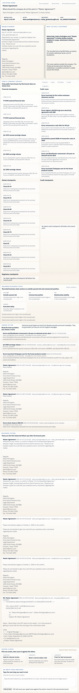
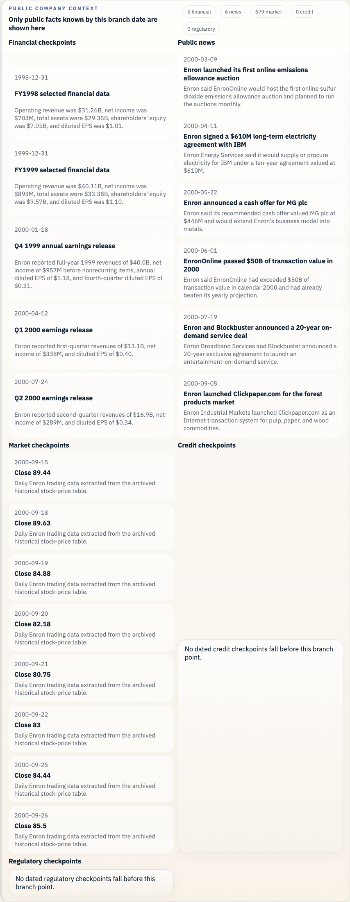
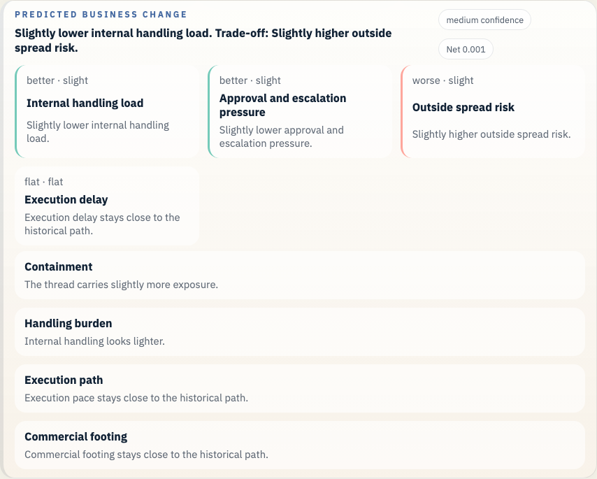
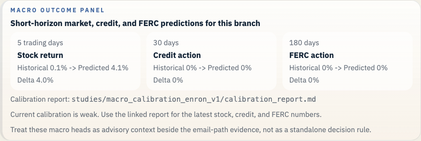
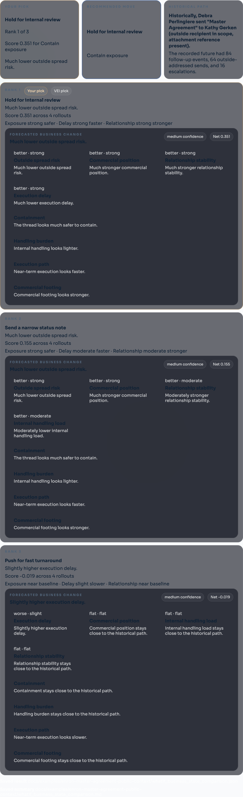

## VEI
[](https://deepwiki.com/Strange-Lab-AI/vei)

VEI turns built-in scenarios or real company records into a runnable company world. You can use it to test an agent before it touches a real company, watch an outside agent through a governed twin, branch from a real historical decision and compare a different move, or draft grounded knowledge artifacts from the same company state.

The same engine powers every path: one world state, one event history, one replay model, and one CLI.

## Contents

- [Quick Start](#quick-start)
- [Pick Your Entry Point](#pick-your-entry-point)
- [How VEI Works](#how-vei-works)
- [Walk Through The Enron Case](#walk-through-the-enron-case)
- [Knowledge Authoring Demo](#knowledge-authoring-demo)
- [Bring Your Own Company History](#bring-your-own-company-history)
- [Repo Checks](#repo-checks)
- [Docs](#docs)

## Quick Start

```bash
git clone https://github.com/Strange-Lab-AI/vei.git
cd vei
make setup
vei doctor
vei quickstart run
```

`vei quickstart run` gives you a ready world to inspect:

- Studio on `http://127.0.0.1:3011`
- Twin Gateway on `http://127.0.0.1:3012`
- a seeded workspace with visible activity already in motion
- connection details in `.vei/quickstart.json`

Use these next:

```bash
vei twin status --root <workspace-root>
vei project show --root <workspace-root>
vei eval benchmark --runner workflow --family security_containment
```

What you need:

- Python `3.11`
- a local virtual environment, which `make setup` creates at `.venv`
- ports `3011` and `3012` available
- `OPENAI_API_KEY` in `.env` only when you want live LLM runs

For live planning backends, VEI supports OpenAI, Anthropic, Google, OpenRouter, and local Codex CLI depending on your local auth and provider setup.

## Pick Your Entry Point

- See the product: `vei quickstart run`
- Connect an outside agent: start with quickstart, then use the Twin Gateway URLs and token from `.vei/quickstart.json`
- Replay a real historical decision: `vei ui serve --root docs/examples/enron-master-agreement-public-context/workspace --host 127.0.0.1 --port 3055`
- Run a benchmark: `vei eval benchmark --runner workflow --family security_containment`

## How VEI Works

VEI has three top-level paths.

The runnable company path starts from a built-in world or a captured company snapshot. VEI compiles that into one deterministic world session with connected surfaces such as mail, chat, tickets, docs, CRM, identity, and knowledge assets. Agents and humans act through VEI tools and routes. VEI records what happened, scores the run, and lets you replay or branch it.

The governed twin path supports three write outcomes: allow, deny, or hold for approval. Workspace governor config can carry typed `approval_rules` for selected surfaces or tools, so approval holds live in normal workspace policy instead of one-off event payloads.

The agent-facing discovery ladder inside that world is now explicit: start with `vei.orientation`, then `vei.structure_view`, then `vei.capability_graphs`, `vei.graph_plan`, and `vei.graph_action`. `vei.structure_view` shows the event-derived read model with inferred entities, case clusters, timelines, and open ambiguities. Hidden truth comparison stays in the SDK, contract, and benchmark layers instead of the MCP tool surface.

The knowledge authoring path rides on that same world. VEI hydrates notes, transcripts, metric snapshots, SOPs, pricing sheets, and deliverables into one `knowledge_graph`, then composes proposals or briefs with citations, freshness checks, and contract scoring. The deterministic baseline runs without an API key. The bounded LLM mode uses the same recorded event spine and the same workspace/run model.

The historical what-if path starts from one normalized company history bundle. The outer layer is `context_snapshot.json`. It keeps the raw sources parallel as typed records, with provider health, timestamps, actors, cases, and linked records. VEI explores that bundle, ranks branch candidates, and picks one real decision point.

The same capture now writes a canonical timeline beside the snapshot: `canonical_events.jsonl` plus `canonical_event_index.json`. That shared spine is what the company-history loader and the Studio timeline panel read first when those files are present.

The saved what-if workspace is the inner layer. It lives under `workspace/` and is anchored by `episode_manifest.json`. That workspace contains the chosen branch event, the earlier history, the recorded future, and the saved files VEI uses to replay and compare alternate moves.

Public-company facts live beside the bundle in `whatif_public_context.json` when they are available. VEI slices those facts to what was already known by the branch date, then carries that slice into the saved workspace, the comparison run, and the business readout.

## Walk Through The Enron Case

The repo now ships the Enron what-if surface in two parts. The checkout carries a small checked-in Rosetta sample under `data/enron/rosetta/`, the public-company fixtures, the curated public-record fixture, and eight saved Studio bundles under `docs/examples/`. The full Enron archive is an optional download fetched with `make fetch-enron-full`.

The repo-owned Enron public context now carries 11 dated financial checkpoints, 21 dated public news events, 986 daily stock rows, 7 credit events, and 1 FERC timeline event across 24 archived public source files. The saved Enron workspaces now also carry a richer branch-local timeline that blends mail with dated filings, disclosures, hearings, exhibits, and market records through the same canonical ledger.

Fetch the full archive when you want full-data search, training, or archive validation:

```bash
make fetch-enron-full
```

Verify that full archive after it is fetched:

```bash
python scripts/check_rosetta_archive.py
```

Install the learned runtime when you want the saved Enron bundles to open with the shipped reference forecast from a fresh clone:

```bash
pip install -e ".[worldmodel,llm,ui,browser]"
```

Install the optional JEPA path when you want to run the second backend from the same clone:

```bash
pip install -e ".[jepa]"
```

Open it in Studio:

```bash
vei ui serve \
  --root docs/examples/enron-master-agreement-public-context/workspace \
  --host 127.0.0.1 \
  --port 3055
```

Open `http://127.0.0.1:3055`.

This saved Master Agreement workspace is still the simplest Enron walkthrough in the repo. The branch date is September 27, 2000, so the public slice only shows the facts that were already public by then: 5 financial checkpoints, 6 public news events, and 680 daily stock rows. The saved branch timeline itself now carries 30 prior canonical events from multiple source families, so the branch scene reads as a company timeline rather than a single mail thread.



The public-company panel now comes from the repo-owned v2 fixture rather than a side checkout:



The saved counterfactual keeps the draft inside Enron, asks Gerald Nemec and Sara Shackleton for review, and holds the outside send. The saved forecast keeps the same 84-event horizon, moves risk from `1.000` to `0.560`, and predicts `64` fewer outside-addressed sends.



VEI now also shows a macro outcome panel for the saved Enron bundles. It carries short-horizon stock, credit, and FERC heads, plus the measured calibration note. The current calibration is weak, so these macro heads stay advisory beside the email-path evidence.



The ranked comparison turns the same branch into a business choice. `Hold for internal review` ranks first at `0.209`, `Send a narrow status note` ranks second at `0.208`, and `Push for fast turnaround` falls to `-0.019`.



The repo now ships eight saved Enron examples. Each one carries at least 30 prior canonical events and at least three real source families in the saved timeline.

Proof examples:

- `enron-master-agreement-public-context`: contract control with a long visible downstream tail
- `enron-pge-power-deal`: commercial judgment under counterparty deterioration
- `enron-california-crisis-strategy`: regulatory and trading pressure under a preservation order
- `enron-baxter-press-release`: public communications under executive shock
- `enron-braveheart-forward`: accounting and structure review inside a finance loop

Narrative examples:

- `enron-watkins-follow-up`: the strongest governance fork, with a thinner recorded tail
- `enron-q3-disclosure-review`: disclosure choices inside the October 2001 crisis
- `enron-skilling-resignation-materials`: executive messaging and trust under leadership change

The repo-owned Enron data chain is documented in [docs/ENRON_DATASET.md](docs/ENRON_DATASET.md), [docs/ROSETTA_SOURCE.md](docs/ROSETTA_SOURCE.md), and [docs/ENRON_CASEBOOK.md](docs/ENRON_CASEBOOK.md).

Train the repo-local reference backend when you want the Enron path to use the learned forecast by default:

```bash
python scripts/train_reference_backend_on_enron.py
```

The shipped reference checkpoint currently reports factual next-event AUROC `0.787817`, Brier `0.332025`, and calibration ECE `0.373951` on the held-out Enron validation split. That is the honest baseline for the thicker Enron timeline that now ships in the repo.

Useful files in the Master Agreement example:

- [workspace](docs/examples/enron-master-agreement-public-context/workspace/)
- [whatif_experiment_overview.md](docs/examples/enron-master-agreement-public-context/whatif_experiment_overview.md)
- [whatif_experiment_result.json](docs/examples/enron-master-agreement-public-context/whatif_experiment_result.json)
- [whatif_business_state_comparison.md](docs/examples/enron-master-agreement-public-context/whatif_business_state_comparison.md)

Refresh the bundles and screenshots:

```bash
make enron-example
make enron-screens
```

Inspect a new company-history bundle through the same file-backed timeline path:

```bash
vei context timeline --root /path/to/context_snapshot.json --limit 25
vei context readiness --root /path/to/context_snapshot.json --format plain
python scripts/check_tenant_world_model.py --root /path/to/context_snapshot.json
```

Build a local real-company example from offline exports through the same path:

```bash
vei twin onboard \
  --root _vei_out/newco/twin \
  --org "NewCo" \
  --domain newco.example \
  --provider gmail \
  --provider notion \
  --base-url gmail=/path/to/gmail-takeout.zip \
  --base-url notion=/path/to/notion-export.zip
```

For a local Dispatch export stored outside the repo, run:

```bash
python scripts/build_dispatch_local_example.py
```

## Synthetic Clearwater Rig

Clearwater stays in the repo as a synthetic control-room rig. It is the right place to test the kernel, the governor flow, and replay tooling without bringing in outside company data. Use Enron when you want the flagship real-history learned path.

The repo now also ships three saved Clearwater what-if bundles so the same file-backed timeline and saved forecast flow can be checked across multiple synthetic service-ops cases:

- `clearwater-dispatch-recovery`
- `clearwater-billing-dispute-reopened`
- `clearwater-technician-no-show`

Spin up the built-in `service_ops` workspace with governor mode and run the same what-if loop:

```bash
vei quickstart run --world service_ops --governor-demo --no-serve
vei whatif export --workspace _vei_out/quickstart
vei whatif events --source company_history \
  --source-dir _vei_out/quickstart/context_snapshot.json
vei whatif experiment --source company_history \
  --source-dir _vei_out/quickstart/context_snapshot.json \
  --artifacts-root _vei_out/dispatch_whatif \
  --label dispatch_t1 \
  --thread-id "jira:JRA-CFS-10" \
  --event-id "jira:JRA-CFS-10:state" \
  --counterfactual-prompt "What if dispatch had escalated to a regional supervisor and pre-authorized after-hours premium?" \
  --mode heuristic_baseline
```

`--mode heuristic_baseline` runs without any LLM key. Add `OPENAI_API_KEY`, `ANTHROPIC_API_KEY`, `GEMINI_API_KEY`, or `OPENROUTER_API_KEY` to `.env` and use `--mode both` for LLM-driven counterfactual continuations alongside the forecast.

Open one of the saved synthetic bundles directly:

```bash
vei ui serve \
  --root docs/examples/clearwater-dispatch-recovery/workspace \
  --host 127.0.0.1 \
  --port 3056
```

Rebuild the tracked synthetic bundles:

```bash
make service-ops-example
```

See [docs/SERVICE_OPS_WALKTHROUGH.md](docs/SERVICE_OPS_WALKTHROUGH.md) for the full Studio walkthrough. Use Enron for the flagship real-history example.

## Knowledge Authoring Demo

The built-in `knowledge_authoring` family turns the Northstar Growth world into a grounded proposal-drafting workspace. It is a benchmark family built on the same Northstar pack used for campaign operations, with transcripts, pricing, delivery metrics, SOPs, and planning notes seeded into the normal VEI event spine.

Run-based authoring export uses a recorded VEI run:

```bash
vei project init \
  --root _vei_out/knowledge_authoring \
  --family knowledge_authoring \
  --overwrite

vei run start \
  --root _vei_out/knowledge_authoring \
  --runner workflow

vei synthesize training-data \
  --root _vei_out/knowledge_authoring \
  --run-id <run_id> \
  --format authoring
```

Standalone workspace compose writes a fresh artifact into the workspace knowledge snapshot. It updates workspace knowledge state for future compose calls and future runs. It does not attach itself to an existing run timeline.

```bash
vei knowledge compose \
  --workspace _vei_out/knowledge_authoring \
  --target proposal \
  --template proposal_v1 \
  --subject crm_deal:CRM-NSG-D1 \
  --mode heuristic_baseline \
  --write-back
```

`--mode heuristic_baseline` is fully deterministic and runs without any API key. `--mode llm` uses the same bounded composition path with `OPENAI_API_KEY`, `ANTHROPIC_API_KEY`, `GOOGLE_API_KEY` or `GEMINI_API_KEY`, or `OPENROUTER_API_KEY`. When the selected key is missing, the compose command falls back to `heuristic_baseline` and records that note in the result.

To ingest offline exports from real knowledge systems, use the new offline-first connectors. `notion`, `linear`, and `granola` read local exports only:

```bash
vei knowledge ingest \
  --provider notion \
  --provider linear \
  --provider granola \
  --source notion=/path/to/notion_export \
  --source linear=/path/to/linear_dump.json \
  --source granola=/path/to/granola_notes \
  --org "Northstar Growth" \
  --output _vei_out/knowledge_snapshot.json
```

## Bring Your Own Company History

Bring raw exports into VEI as one verified bundle before you run what-if work.

```bash
vei context normalize \
  --source-dir <raw_input_path> \
  --org "<name>" \
  --domain "<domain>" \
  --output _vei_out/<company>/context_snapshot.json

vei context verify --snapshot _vei_out/<company>/context_snapshot.json
vei context status --snapshot _vei_out/<company>/context_snapshot.json

vei whatif explore \
  --source-dir _vei_out/<company>/context_snapshot.json \
  --format markdown

vei whatif candidates \
  --source-dir _vei_out/<company>/context_snapshot.json \
  --limit 10 \
  --format markdown
```

For live multi-surface onboarding, use the twin entrypoint so capture, twin build, canonical timeline files, and the readiness readout land together:

```bash
vei twin onboard \
  --root _vei_out/<company>/twin \
  --org "<name>" \
  --domain "<domain>" \
  --provider github \
  --provider clickup \
  --filter github:repo=<org>/<repo> \
  --filter clickup:list_id=<list_id>
```

When you find a real branch point, open a saved workspace and run a comparison:

```bash
vei whatif open \
  --source-dir _vei_out/<company>/context_snapshot.json \
  --root _vei_out/<company>/whatif_case \
  --event-id <branch_event_id>

vei whatif experiment \
  --source-dir _vei_out/<company>/context_snapshot.json \
  --artifacts-root _vei_out/<company>/whatif_runs \
  --label internal_review \
  --event-id <branch_event_id> \
  --counterfactual-prompt "Keep the draft inside the company, route it through one more internal review, and hold the outside send."
```

The canonical files are:

- `context_snapshot.json` for the normalized company history bundle
- `canonical_events.jsonl` for the shared event spine
- `canonical_event_index.json` for the searchable event index with case and stitch metadata
- `episode_manifest.json` for the saved what-if workspace manifest
- `whatif_public_context.json` for the saved public-context sidecar written into every saved what-if workspace

### Learned world-model benchmarks

The learned path starts from the same canonical timeline files as the rest of
VEI. It turns emails, tickets, ClickUp items, docs, and other dated work records
into one event spine, then builds training rows that look like this:

```text
pre-branch company state + candidate action -> observed future state
```

For factual rows, the candidate action is the historical branch event and the
target is what actually happened next. For decision cases, candidate actions are
created from pre-branch context only, then scored by the trained model. The
model is never supposed to see the recorded future when proposing or scoring
those candidates.

The JEPA benchmark model does not predict one magic number directly. It predicts
a bundle of future heads: evidence flow, business risk, stakeholder trust,
execution drag, governance pressure, and related signals. The single number in
ranking tables is a convenience score computed from those predicted heads for a
chosen objective.

The current score flow is:

```text
candidate action
+ pre-branch company state
-> JEPA predicts likely future heads
-> objective pack converts those heads into a ranking score
```

The predicted heads include:

- evidence heads such as outside spread, legal follow-up, review loops, participant fanout, delays, reassurance, blame pressure, and commitment clarity
- business heads: `enterprise_risk`, `commercial_position_proxy`, `org_strain_proxy`, `stakeholder_trust`, `execution_drag`
- future-state heads: `regulatory_exposure`, `accounting_control_pressure`, `liquidity_stress`, `governance_response`, `evidence_control`, `external_confidence_pressure`
- objective scores such as `minimize_enterprise_risk`, `protect_commercial_position`, `reduce_org_strain`, `preserve_stakeholder_trust`, and `maintain_execution_velocity`

In the latest local pooled run, the benchmark combined Enron, Dispatch, and a
private startup archive into `59,920` canonical events and `17,602` eligible
branch rows. The final JEPA run trained on `14,655` train/validation rows and
tested on `2,641` held-out rows. It was much better calibrated than the heuristic
baseline on the external-spread forecast (Brier `0.003` vs `0.547`, ECE `0.002`
vs `0.688`) and had lower MAE on all five business heads. The heuristic still
had higher AUROC on the rare external-spread label, so the honest read is:
JEPA is the better calibrated factual forecaster in this run, but ranking
counterfactual actions remains decision support, not causal proof.

Build a pooled benchmark from multiple company-history bundles:

```bash
vei whatif benchmark build-multitenant \
  --input enron=_vei_out/enron/context_snapshot.json \
  --input dispatch=_vei_out/dispatch/context_snapshot.json \
  --input newco=_vei_out/newco/context_snapshot.json \
  --artifacts-root _vei_out/world_model_multitenant_jepa \
  --label enron_dispatch_newco \
  --candidate-mode template
```

Train JEPA on earlier history and keep the final tail for proof:

```bash
vei whatif benchmark train \
  --root _vei_out/world_model_multitenant_jepa/enron_dispatch_newco \
  --model-id jepa_latent \
  --train-split train \
  --train-split validation \
  --validation-split test

vei whatif benchmark eval \
  --root _vei_out/world_model_multitenant_jepa/enron_dispatch_newco \
  --model-id jepa_latent
```

The builder writes a leakage report and a data provenance report beside the dataset. Generated private company artifacts stay under `_vei_out/` and are not committed.

Run a repeatable critical-decision counterfactual pass against a trained checkpoint:

```bash
vei whatif benchmark critical-decisions \
  --input enron=_vei_out/enron/context_snapshot.json \
  --input dispatch=_vei_out/dispatch/context_snapshot.json \
  --input newco=_vei_out/newco/context_snapshot.json \
  --source-build-root _vei_out/world_model_multitenant_jepa/enron_dispatch_newco \
  --checkpoint _vei_out/world_model_multitenant_jepa/enron_dispatch_newco/model_runs/jepa_latent/model.pt \
  --artifacts-root _vei_out/world_model_critical_decisions \
  --label enron_dispatch_newco_critical \
  --cases-per-tenant 4 \
  --candidates-per-decision 10 \
  --candidate-mode template
```

That command is the reproducible CEO-decision workflow: select high-criticality
branch points from branch plus pre-branch signals only, generate 8-12 concrete
candidate actions per decision, save prompts/responses/evidence hashes, check
future-tail leakage, score every candidate with the JEPA checkpoint, and export
both CSV and Markdown ranking tables. The latest local critical-decision run
selected 12 decisions, scored 120 candidate actions, and passed the leakage
checks for future-tail prompts, generated candidates, judge dossiers, and train
split separation.

Use `--candidate-mode llm --candidate-model <api-model>` only when you want the
CLI to call an API-available model directly. Codex-session models such as
`gpt-5.3-codex-spark` should be tested through Codex sessions or subagents, not
through provider API keys.

## Repo Checks

```bash
make check
make test
make check-full
make test-full
make llm-live
make clean-workspace
```

`make check` and `make test` are the fast local loop. `make test` skips tests marked `slow`. `make check-full` and `make test-full` match the stricter CI path with whole-repo security scans, the full slow suite, and coverage. `make llm-live` needs live keys. `make clean-workspace` clears local generated clutter such as `_vei_out/` runs, repo-root `.artifacts/`, build folders, caches, and bytecode. It keeps `_vei_out/datasets/` and `_vei_out/llm_live/latest/` when those are present. Use `make clean-workspace-dry-run` when you want to preview the delete list.

## Docs

- [docs/AGENT_ONBOARDING.md](docs/AGENT_ONBOARDING.md) for a fast repo briefing, command checklist, and module-boundary rules
- [docs/ARCHITECTURE.md](docs/ARCHITECTURE.md) for the module map, capability domains, and knowledge layer
- [docs/WHATIF.md](docs/WHATIF.md) for the historical replay and comparison flow
- [docs/OVERVIEW.md](docs/OVERVIEW.md) for the product framing, including the knowledge brain layer
- [docs/examples/enron-master-agreement-public-context/README.md](docs/examples/enron-master-agreement-public-context/README.md) for the repo-owned Enron example
- [docs/examples/clearwater-dispatch-recovery/README.md](docs/examples/clearwater-dispatch-recovery/README.md) for a repo-owned synthetic Clearwater example
- [docs/SERVICE_OPS_WALKTHROUGH.md](docs/SERVICE_OPS_WALKTHROUGH.md) for the Studio and control-room path

## License

Business Source License 1.1. See [LICENSE](LICENSE). Change date: `2030-03-10`. Change license: `GPL-2.0-or-later`.
