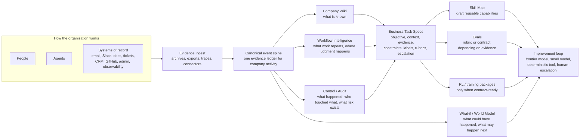
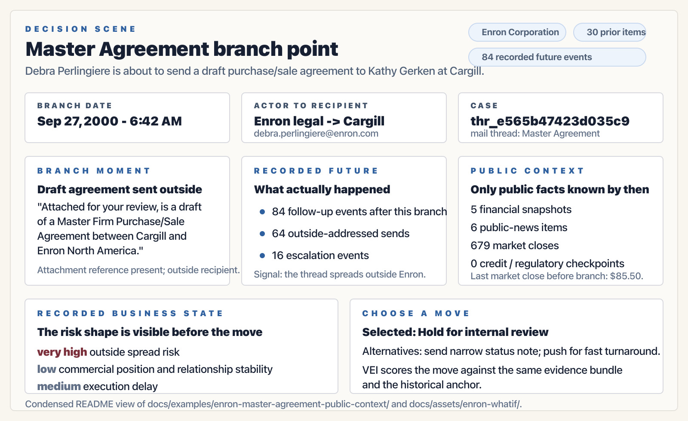

## VEI

[](https://deepwiki.com/Strange-Lab-AI/vei)

**VEI** builds a runnable replica of any organisation or situation from real records. You use it to replay historical decisions and compare alternate moves, test agents before they touch production systems, turn agent traces into RL training data, and compile company-specific knowledge and skills from ongoing company state.

Try it now: [strangelab.ai/enron](https://strangelab.ai/enron) · [strangelab.ai/public-history](https://strangelab.ai/public-history)

VEI keeps company activity in one evidence ledger. From that ledger it builds the
company wiki, workflow specs, what-if replays, audit views, evals, and training
packages.


```mermaid
flowchart LR
    subgraph ORG["How the organisation works"]
        A["People"]
        B["Agents"]
        C["Systems of record<br/>email, Slack, docs, tickets,<br/>CRM, GitHub, admin, observability"]
    end

    ORG --> INGEST["Evidence ingest<br/>archives, exports, traces, connectors"]

    INGEST --> SPINE["Canonical event spine<br/>one evidence ledger for company activity"]

    SPINE --> WIKI["Company Wiki<br/>what is known"]
    SPINE --> WORKFLOW["Workflow Intelligence<br/>what work repeats, where judgment happens"]
    SPINE --> CONTROL["Control / Audit<br/>what happened, who touched what, what risk exists"]
    SPINE --> WHATIF["What-if / World Model<br/>what could have happened, what may happen next"]

    WORKFLOW --> SPEC["Business Task Specs<br/>objective, context, evidence,<br/>constraints, labels, rubrics, escalation"]
    WIKI --> SPEC
    CONTROL --> SPEC

    SPEC --> SKILLS["Skill Map<br/>draft reusable capabilities"]
    SPEC --> EVALS["Evals<br/>rubric or contract depending on evidence"]
    SPEC --> PACKAGES["RL / training packages<br/>only when contract-ready"]

    SKILLS --> IMPROVE["Improvement loop<br/>frontier model, small model,<br/>deterministic tool, human escalation"]
    EVALS --> IMPROVE
    WHATIF --> IMPROVE
    PACKAGES --> IMPROVE
```

## The Five Surfaces

**1. Test / Eval** — Run a fixed company world and score an agent. Compare scripted, workflow, behavioral-cloning, and live LLM runners on the same scenario. See [docs/EVALS.md](docs/EVALS.md).

**2. Governor / Control** — Place VEI between agents and enterprise systems. Ingest agent activity from JSONL, MCP transcripts, or OpenAI org exports. Review access, blast radius, and policy compliance. Export evidence packs. See [docs/ARCHITECTURE.md](docs/ARCHITECTURE.md) § VEI Control.

**3. Sandbox / What-if** — Fork a world, change a policy or action, compare alternate futures. Branch from real historical decisions in the Enron archive, from your own company data, or from public news timelines. See [docs/WHATIF.md](docs/WHATIF.md).

**4. Train / Data** — Turn traces into rollouts, demonstrations, and RL-friendly data. Train world models (JEPA / reference backend) on canonical event sequences to forecast future state and rank counterfactual actions. See [docs/RL_GYM.md](docs/RL_GYM.md).

**5. Knowledge / Skill Map** — Hydrate notes, transcripts, metrics, SOPs, and pricing into a knowledge graph; compose proposals or briefs with citations. Compile company-specific agent skills from the normalized bundle, with replay checks and evidence backing.

Workflow intelligence now sits across these surfaces: `vei workflow` mines repeated work from canonical company history, promotes evidence-backed Business Task Specs, and packages only reviewed RL-ready specs into process environments.

## Quick Start

```bash
git clone https://github.com/Strange-Lab-AI/vei.git
cd vei                # or your checkout folder name
make setup-full       # creates .venv, installs all extras
vei doctor            # checks environment
vei quickstart run    # launches Studio + Twin Gateway
```

`vei quickstart run` gives you:

- Studio at `http://127.0.0.1:3011`
- Twin Gateway at `http://127.0.0.1:3012`
- a seeded workspace with visible activity already in motion
- connection details in `.vei/quickstart.json`

**Requirements:** Python 3.11, ports 3011 and 3012 free. Local interactive LLM generation defaults to the Codex CLI (`gpt-5.3-codex-spark`). `OPENAI_API_KEY` in `.env` is only needed for explicit direct-provider runs or CI-style `llm-live`.

For the optional JEPA backend by itself:

```bash
pip install -e ".[jepa]"
```

`make setup-full` already includes this extra for full local development.

### Try a saved example

Open the flagship Enron what-if bundle from a fresh clone — no API key needed:

```bash
vei ui serve \
  --root docs/examples/enron-master-agreement-public-context/workspace \
  --host 127.0.0.1 --port 3055
```

Studio exposes the what-if surface as two explicit modes when both are available: **Live archive** for full-history exploration and **Saved reference** for the committed branch replay. Live archive remains the default and warms its loaded world in the UI server after status loads, so whole-history exploration stays visible without hiding behind the saved reference path.



See [docs/EXAMPLES.md](docs/EXAMPLES.md) for all saved bundles (Enron, public history, Clearwater).

## CLI Map

All commands live under `vei <group> <command>`. The top-level surface is
grouped by product workflow:

| Surface | Key commands |
|---|---|
| **Quickstart** | `vei admin quickstart run`, `vei admin doctor`, `vei eval smoke run` |
| **Test / Eval** | `vei eval benchmark`, `vei eval demo`, `vei eval showcase`, `vei eval llm-test run`, `vei run start`, `vei admin report` |
| **Governor / Control** | `vei workspace twin serve`, `vei workspace twin onboard`, `vei workspace ingest agent-activity`, `vei provenance access-review`, `vei provenance verify`, `vei provenance export` |
| **Sandbox / What-if** | `vei whatif candidates`, `vei whatif events`, `vei whatif open`, `vei whatif experiment` (`--mode e_jepa` for the trained backend), `vei whatif rank`, `vei whatif pack run` |
| **Train / Data** | `vei rollout procurement`, `vei train bc`, `vei workflow package-env` |
| **Knowledge / Skills / Wiki** | `vei knowledge compose`, `vei knowledge ingest`, `vei knowledge skillmap build`, `vei knowledge skillmap refresh`, `vei wiki build`, `vei wiki refresh`, `vei wiki query` |
| **Workflow intelligence** | `vei workflow mine`, `vei workflow label`, `vei workflow promote`, `vei workflow refresh` |
| **Inspect / Debug** | `vei admin world list`, `vei inspect fidelity`, `vei workspace context timeline`, `vei workspace context readiness`, `vei admin visualize`, `vei ui serve` |
| **Project / Workspace** | `vei workspace project init`, `vei workspace project show`, `vei admin blueprint`, `vei admin contract`, `vei admin release` |
| **Static-site exports** | `python scripts/export_enron_static_assets.py`, `python scripts/export_public_history_static_assets.py` (powers `strangelab.ai/enron` and `strangelab.ai/public-history`) |

## Bring Your Own Company History

```bash
# Normalize raw exports into a verified bundle
vei context normalize \
  --source-dir <raw_input_path> \
  --org "YourCo" --domain "yourco.example" \
  --output _vei_out/yourco/context_snapshot.json

vei context verify --snapshot _vei_out/yourco/context_snapshot.json

# Or: onboard from live sources (GitHub, ClickUp, Gmail, Notion, etc.)
vei workspace twin onboard \
  --root _vei_out/yourco/twin \
  --org "YourCo" --domain "yourco.example" \
  --provider gmail --provider notion \
  --base-url gmail=/path/to/gmail-takeout.zip \
  --base-url notion=/path/to/notion-export.zip
```

### Experimental PipesHub Connector Pilot

VEI can also launch a local PipesHub stack and snapshot its synced enterprise
records into the same canonical company-history bundle. PipesHub remains a
separate connector/search service; VEI pulls a point-in-time snapshot and writes
reviewable local artifacts.

```bash
pip install -e ".[pipeshub]"

# Generate a local Compose profile and start PipesHub.
vei connectors pipeshub up

# Configure connectors in the local PipesHub UI, then inspect what VEI can ingest.
vei context pipeshub inspect

# Pull a snapshot from PipesHub into VEI.
vei context pipeshub capture \
  --workspace _vei_out/yourco \
  --org "YourCo" --domain "yourco.example" \
  --connector gmailworkspace \
  --connector driveworkspace \
  --connector jira \
  --connector confluence \
  --connector salesforce \
  --connector onedrive \
  --connector outlook
```

The capture writes raw evidence under
`imports/source_syncs/pipeshub/<run_id>/`, then writes
`context_snapshot.json`, `canonical_events.jsonl`, and
`canonical_event_index.json`. Good v1 PipesHub-backed sources include Google
Drive/Gmail, Confluence/Jira, Salesforce, OneDrive/SharePoint, Outlook, Box,
Dropbox, Notion, ServiceNow, Linear, GitHub, and GitLab. Microsoft Teams and
ClickUp are reported as unsupported for PipesHub ingestion in this lane; use
VEI's direct ClickUp provider and Slack/export paths until those connectors have
mature normalized sync support.

Then explore branch points, run what-if experiments, build a wiki, or compile
a skill map — all from the same canonical event spine:

```bash
# 1. Rank strong branch points (no LLM, no training)
vei whatif candidates --source-dir _vei_out/yourco/context_snapshot.json --limit 10

# 2. Run a counterfactual. --mode e_jepa trains a structured-state JEPA on the
#    spine and predicts; --mode heuristic_baseline is deterministic and fast.
vei whatif experiment \
  --source-dir _vei_out/yourco/context_snapshot.json \
  --label first_experiment \
  --counterfactual-prompt "What if escalation had gone through legal first?" \
  --mode e_jepa --forecast-backend e_jepa

# 3. Build the company wiki (Overview, Recent Changes, Cases, People,
#    Knowledge, Skills, Evidence Index). Citations link back to canonical
#    events; nothing from synthetic vertical packs is mixed in.
vei wiki build --source-dir _vei_out/yourco/context_snapshot.json \
  --output _vei_out/yourco/wiki

# 4. Compile evidence-backed skills (LLM-derived, every step cited)
vei knowledge skillmap build \
  --source-dir _vei_out/yourco/context_snapshot.json \
  --output _vei_out/yourco/skill_map

# 5. When real agent activity has been imported into the workspace, refresh
#    skills + wiki from the context plus the Control evidence spine.
vei knowledge skillmap refresh --workspace _vei_out/yourco \
  --output _vei_out/yourco/skill_map
vei wiki refresh --workspace _vei_out/yourco

# 6. Mine recurring work and promote an evidence-backed task spec.
vei workflow mine \
  --source-dir _vei_out/yourco/context_snapshot.json \
  --output _vei_out/yourco/workflows
vei workflow promote \
  --root _vei_out/yourco/workflows \
  --candidate-id <candidate-id> \
  --output _vei_out/yourco/workflows/task_spec.json
```

For a checked-in end-to-end example of the workflow-intelligence ladder, see
[docs/examples/workflow-intelligence-walkthrough](docs/examples/workflow-intelligence-walkthrough/).

Hardening smokes for public-facing paths:

```bash
make codex-live-smoke      # Codex-backed planning, skillmap, and what-if smoke
make worldmodel-smoke      # JEPA/reference world-model contracts
make public-demo-smoke     # strangelab.ai/enron and /public-history assets
make workflow-intel-smoke  # workflow mining/spec/package gates
```

Run a real LLM agent against the resulting twin via MCP stdio:

```bash
vei eval llm-test run \
  --provider openai --model gpt-5 \
  --task "Triage the open exception and reply to the customer." \
  --artifacts _vei_out/yourco/llm_run
```

Full command reference: [docs/WHATIF.md](docs/WHATIF.md).

## Repo Checks

```bash
make check          # format, lint, types, import boundaries, security
make test           # fast tests (skips slow)
make check-full     # + bandit, semgrep, detect-secrets
make test-full      # full suite with coverage
make llm-live       # needs live API keys
make clean-workspace  # clears caches; leaves _vei_out/ runs alone
```

Exit codes: `0` pass · `1` test/gate failure · `2` cost ceiling exceeded · `3` infrastructure failure · `4` threshold/config missing.

## Where to Go Next

- [docs/AGENT_ONBOARDING.md](docs/AGENT_ONBOARDING.md) — fast repo briefing and 10-minute checklist for humans and agents
- [docs/ARCHITECTURE.md](docs/ARCHITECTURE.md) — module map, five surfaces, runtime shape, what is and isn't learned
- [docs/GLOSSARY.md](docs/GLOSSARY.md) — every term of art used in this repo, defined in one place
- [docs/WHATIF.md](docs/WHATIF.md) — world-model and what-if command reference
- [docs/EXAMPLES.md](docs/EXAMPLES.md) — Enron, public history, and Clearwater worked examples
- [docs/EVALS.md](docs/EVALS.md) — evaluation layers: factual metrics, LLM judge, human audit
- [docs/RL_GYM.md](docs/RL_GYM.md) — scoped RL-training plan over deterministic process contracts
- [CONTRIBUTING.md](CONTRIBUTING.md) — setup, daily loop, module boundaries, PR workflow

## License

Business Source License 1.1. See [LICENSE](LICENSE). Change date: `2030-03-10`. Change license: `GPL-2.0-or-later`.
