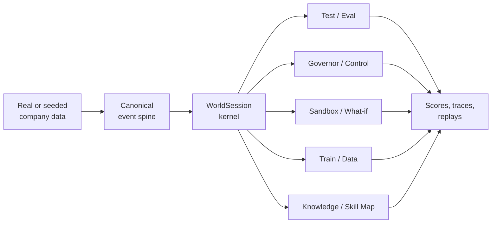
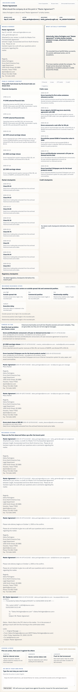

## VEI

[](https://deepwiki.com/Strange-Lab-AI/vei)

**VEI** builds a runnable replica of any organisation or situation from real records. You use it to replay historical decisions and compare alternate moves, test agents before they touch production systems, turn agent traces into RL training data, and compile company-specific knowledge and skills from ongoing company state.

Try it now: [strangelab.ai/enron](https://strangelab.ai/enron) · [strangelab.ai/public-history](https://strangelab.ai/public-history)

One deterministic kernel powers every path: one world state, one event spine, one replay model, one CLI.


```mermaid
flowchart LR
    A[Real or seeded\ncompany data] --> B[Canonical\nevent spine]
    B --> C[WorldSession\nkernel]
    C --> D[Test / Eval]
    C --> E[Governor / Control]
    C --> F["Sandbox / What-if"]
    C --> G[Train / Data]
    C --> H["Knowledge / Skill Map"]
    D --> I[Scores, traces,\nreplays]
    E --> I
    F --> I
    G --> I
    H --> I
```

## The Five Surfaces

**1. Test / Eval** — Run a fixed company world and score an agent. Compare scripted, workflow, behavioral-cloning, and live LLM runners on the same scenario. See [docs/EVALS.md](docs/EVALS.md).

**2. Governor / Control** — Place VEI between agents and enterprise systems. Ingest agent activity from JSONL, MCP transcripts, or OpenAI org exports. Review access, blast radius, and policy compliance. Export evidence packs. See [docs/ARCHITECTURE.md](docs/ARCHITECTURE.md) § VEI Control.

**3. Sandbox / What-if** — Fork a world, change a policy or action, compare alternate futures. Branch from real historical decisions in the Enron archive, from your own company data, or from public news timelines. See [docs/WHATIF.md](docs/WHATIF.md).

**4. Train / Data** — Turn traces into rollouts, demonstrations, and RL-friendly data. Train world models (JEPA / reference backend) on canonical event sequences to forecast future state and rank counterfactual actions. See [docs/RL_GYM.md](docs/RL_GYM.md).

**5. Knowledge / Skill Map** — Hydrate notes, transcripts, metrics, SOPs, and pricing into a knowledge graph; compose proposals or briefs with citations. Compile company-specific agent skills from the normalized bundle, with replay checks and evidence backing.

## Quick Start

```bash
git clone https://github.com/Strange-Lab-AI/vei.git
cd vei                # or your checkout folder name
make setup-full       # creates .venv, installs all extras
vei doctor            # checks environment
vei quickstart run    # launches Studio + Twin Gateway
```

`vei quickstart run` gives you:

- Studio at `http://127.0.0.1:3011`
- Twin Gateway at `http://127.0.0.1:3012`
- a seeded workspace with visible activity already in motion
- connection details in `.vei/quickstart.json`

**Requirements:** Python 3.11, ports 3011 and 3012 free. `OPENAI_API_KEY` in `.env` only when you want live LLM runs. VEI also supports Anthropic, Google, OpenRouter, and local Codex CLI for live planning backends.

### Try a saved example

Open the flagship Enron what-if bundle from a fresh clone — no API key needed:

```bash
vei ui serve \
  --root docs/examples/enron-master-agreement-public-context/workspace \
  --host 127.0.0.1 --port 3055
```



See [docs/EXAMPLES.md](docs/EXAMPLES.md) for all saved bundles (Enron, public history, Clearwater).

## CLI Map

All commands live under `vei <group> <command>`.

| Surface | Key commands |
|---|---|
| **Quickstart** | `quickstart run`, `doctor`, `smoke run` |
| **Test / Eval** | `eval benchmark`, `eval demo`, `eval suite`, `eval showcase`, `run start`, `score`, `llm-test run` |
| **Governor / Control** | `twin serve`, `twin onboard`, `ingest agent-activity`, `provenance access-review`, `provenance verify`, `provenance export` |
| **Sandbox / What-if** | `whatif explore`, `whatif events`, `whatif open`, `whatif experiment`, `whatif benchmark build-multitenant`, `whatif benchmark strategic-state-points` |
| **Train / Data** | `rollout`, `train bc`, `pack`, `synthesize training-data` |
| **Knowledge / Skills** | `knowledge compose`, `knowledge ingest`, `skillmap build`, `skillmap validate` |
| **Inspect / Debug** | `world list`, `inspect fidelity`, `context timeline`, `context readiness`, `visualize`, `ui serve` |
| **Project / Workspace** | `project init`, `project show`, `blueprint`, `contract`, `scenario`, `workspace`, `release` |

## Bring Your Own Company History

```bash
# Normalize raw exports into a verified bundle
vei context normalize \
  --source-dir <raw_input_path> \
  --org "YourCo" --domain "yourco.example" \
  --output _vei_out/yourco/context_snapshot.json

vei context verify --snapshot _vei_out/yourco/context_snapshot.json

# Or: onboard from live sources (GitHub, ClickUp, Gmail, Notion, etc.)
vei twin onboard \
  --root _vei_out/yourco/twin \
  --org "YourCo" --domain "yourco.example" \
  --provider gmail --provider notion \
  --base-url gmail=/path/to/gmail-takeout.zip \
  --base-url notion=/path/to/notion-export.zip
```

Then explore branch points, run what-if experiments, or compile a skill map:

```bash
vei whatif candidates --source-dir _vei_out/yourco/context_snapshot.json --limit 10
vei skillmap build --source-dir _vei_out/yourco/context_snapshot.json --output _vei_out/yourco/skill_map
```

Full command reference: [docs/WHATIF.md](docs/WHATIF.md).

## Repo Checks

```bash
make check          # format, lint, types, import boundaries, security
make test           # fast tests (skips slow)
make check-full     # + bandit, semgrep, detect-secrets
make test-full      # full suite with coverage
make llm-live       # needs live API keys
make clean-workspace  # clears caches; leaves _vei_out/ runs alone
```

Exit codes: `0` pass · `1` test/gate failure · `2` cost ceiling exceeded · `3` infrastructure failure · `4` threshold/config missing.

## Where to Go Next

- [docs/AGENT_ONBOARDING.md](docs/AGENT_ONBOARDING.md) — fast repo briefing and 10-minute checklist for humans and agents
- [docs/ARCHITECTURE.md](docs/ARCHITECTURE.md) — module map, five surfaces, runtime shape, what is and isn't learned
- [docs/GLOSSARY.md](docs/GLOSSARY.md) — every term of art used in this repo, defined in one place
- [docs/WHATIF.md](docs/WHATIF.md) — world-model and what-if command reference
- [docs/EXAMPLES.md](docs/EXAMPLES.md) — Enron, public history, and Clearwater worked examples
- [docs/EVALS.md](docs/EVALS.md) — evaluation layers: factual metrics, LLM judge, human audit
- [docs/RL_GYM.md](docs/RL_GYM.md) — scoped RL-training plan over deterministic process contracts
- [CONTRIBUTING.md](CONTRIBUTING.md) — setup, daily loop, module boundaries, PR workflow

## License

Business Source License 1.1. See [LICENSE](LICENSE). Change date: `2030-03-10`. Change license: `GPL-2.0-or-later`.
