# VEI Service Operations Pack — Visual Walkthrough

**Clearwater Field Services** — a simulated field service company where a VIP outage, technician no-show, and billing dispute all collide on the same account before 9 AM.

This walkthrough captures the live Studio UI running the `service_ops` vertical pack with mirror mode enabled: situation room, agent fleet panel, policy change ceremony, governance UX, weighted scoring, and live agent monitoring.

---

## 1. Entering the World

The Studio opens with the company identity front and center. Three controls configure the simulation:

- **Company**: Clearwater Field Services
- **Crisis**: Service Day Collision, Technician No-Show, or Billing Dispute Reopened
- **Success means**: Protect SLA, Protect Revenue, or Protect Customer Trust

Each objective weights assertions differently — Protect SLA values dispatch recovery 3x, Protect Revenue values billing holds 3x, and Protect Customer Trust values communication artifacts 3x. Same moves, different scores.

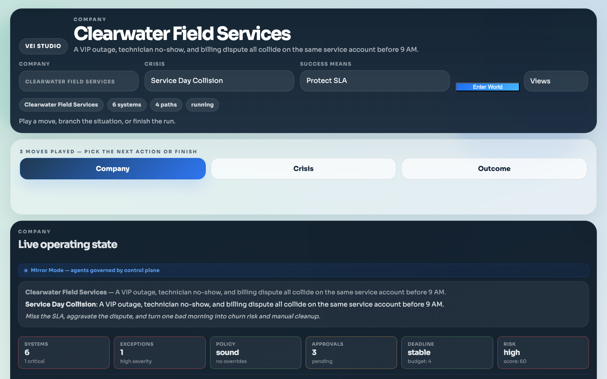

---

## 2. Situation Room Strip — Monday Morning at a Glance

Below the company context, a **situation room strip** shows the operator the full picture in 3 seconds:

| Cell | Value | Detail |
|------|-------|--------|
| Systems | 6 | 1 critical |
| Exceptions | 1 | high severity |
| Policy | sound | no overrides |
| Approvals | 3 | pending |
| Deadline | stable | budget: 4 |
| Risk | high | score: 60 |

Color-coded borders (green/amber/red) indicate which cells need attention. This strip updates after every move.

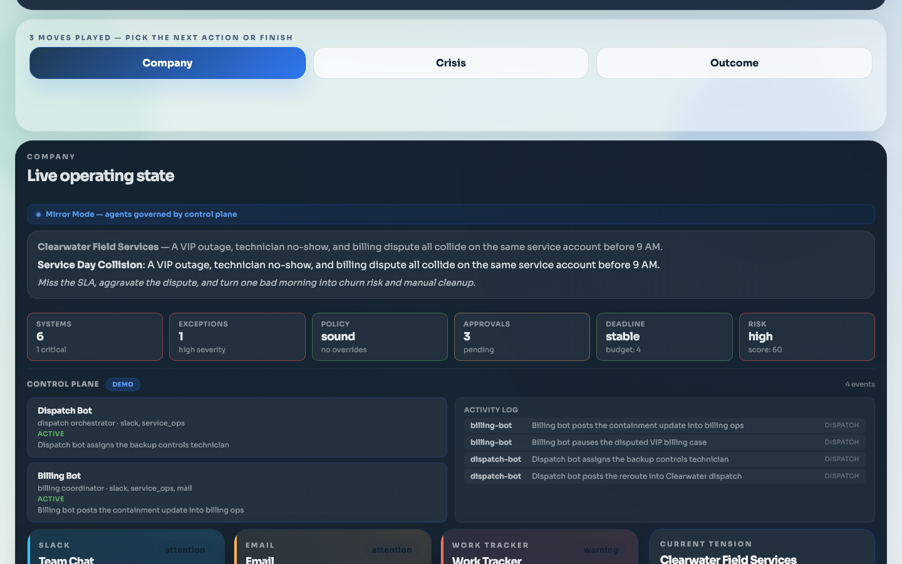

---

## 3. Agent Fleet — Mirror Mode in Action

Directly below the situation room, the **Agent Fleet** panel shows which autonomous agents are operating in this workspace. In mirror-demo mode, two agents are pre-seeded:

| Agent | Role | Surfaces | Status |
|-------|------|----------|--------|
| Dispatch Bot | dispatch orchestrator | slack, service_ops | active |
| Billing Bot | billing coordinator | slack, service_ops, mail | active |

The panel also shows:
- **Mode badge**: "demo mode" (blue) for staged demonstrations, "live mode" (green) for real agent traffic
- **Event counter**: Total events processed by the mirror runtime
- **Queue status**: Whether autoplay is active or manual ticks are required

This is the control plane's awareness of what agents are doing — the human operator sees their agent fleet at all times alongside system health.

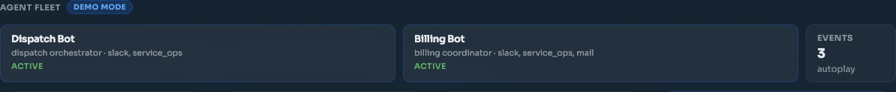

---

## 4. Live Operating State — Six Interconnected Systems

The Company view shows the full surface wall with all enterprise work surfaces:

- **Slack** (5 channels, 12+ messages) — CFO, COO, dispatch lead, technicians, billing ops
- **Email** (4 threads, 3 unread) — Urgent rooftop unit failure, billing dispute, technician sick call
- **Work Tracker** (5 active tickets) — VIP outage command, tech roster, backup dispatch, billing dispute
- **Documents** (5 artifacts) — VIP Account Brief, Response Runbook, Field-To-Billing Handoff, Dispatch Board, Billing Notes
- **Approvals** (4 routed requests) — VIP emergency dispatch, billing hold, customer comms, overtime
- **Service Loop** (Business Core) — Work orders, appointments, billing cases, exceptions

Mirror-initiated events appear as regular entries in these surfaces — when the Dispatch Bot posts to Slack or the Billing Bot holds a billing case, those actions show up here alongside human moves.

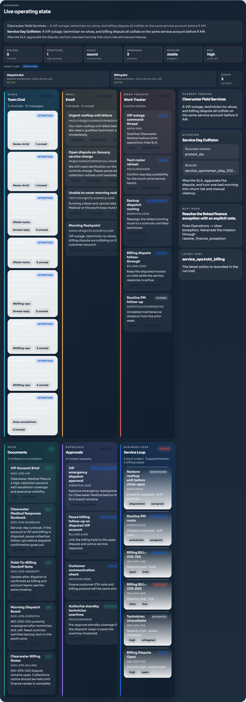

---

## 5. Mission Control — Scoring and Moves

The mission control panel tracks the current state:

| Metric | Value |
|--------|-------|
| Score | 60 |
| Mission | in play |
| Budget left | 4 |
| Risk | high |
| Deadline | stable |
| Policy | sound |

Move cards are categorized by availability:
- **Blocked/Used** — Already played on this branch
- **Recommended** — Resolve the finance exception, Update the handoff document
- **Available** — Write recovery note, Post ops summary
- **Risky** — Raise the hold threshold (amber chip, governance-gated)

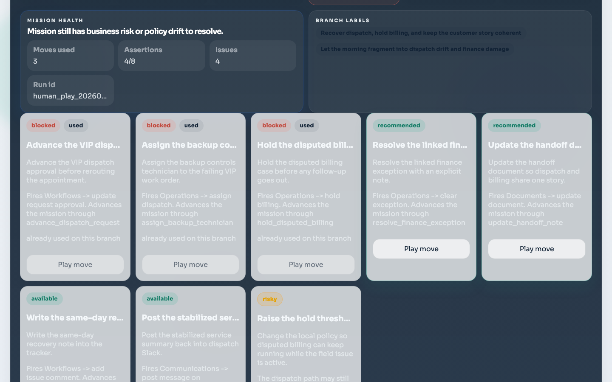

---

## 6. Policy Change Ceremony

Clicking "Take risky move" opens a **policy override modal** — the operator must acknowledge the change before it fires:

- **"POLICY OVERRIDE"** amber badge
- **Move title**: "Raise the hold threshold and leave billing live"
- **Consequence preview**: "The dispatch path may still recover, but the account relationship gets much harder to protect."
- **Policy diff table**:
  - billing hold on dispute: ~~current~~ → **false**
  - approval threshold usd: ~~current~~ → **2500**
  - reason: → "Forced risky policy change."
- **Cancel / Confirm override** buttons

This creates real friction — the operator explicitly acknowledges the policy change before it executes.

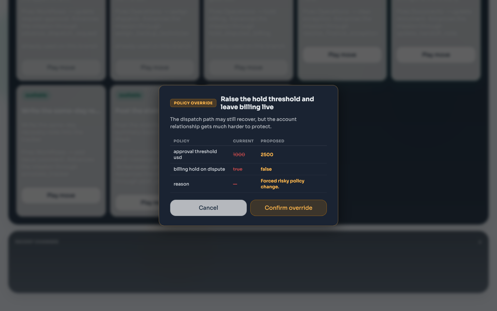

---

## 7. After Policy Override

After confirming the override, the UI updates to reflect the new state. The budget decreases, and the policy change is recorded.

The situation room strip, agent fleet panel, and surface wall all update in real time. The operator sees both their own actions and the agents' reactions in one unified view.

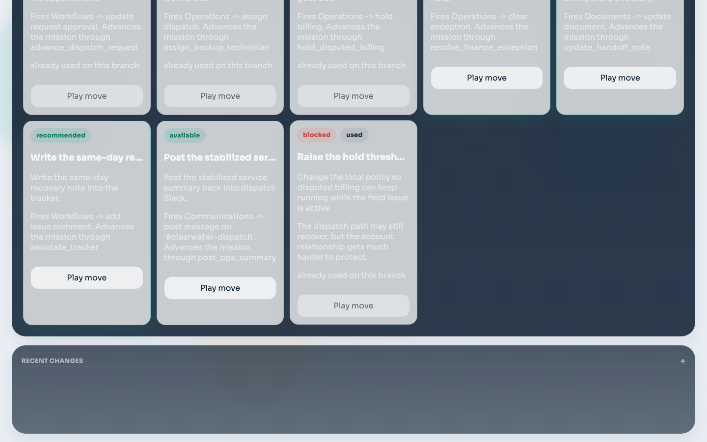

---

## 8. Updated Mission Score

After a move, the mission scorecard updates with the new score, remaining budget, and risk level. The assertions panel shows which objectives have been met and which remain.

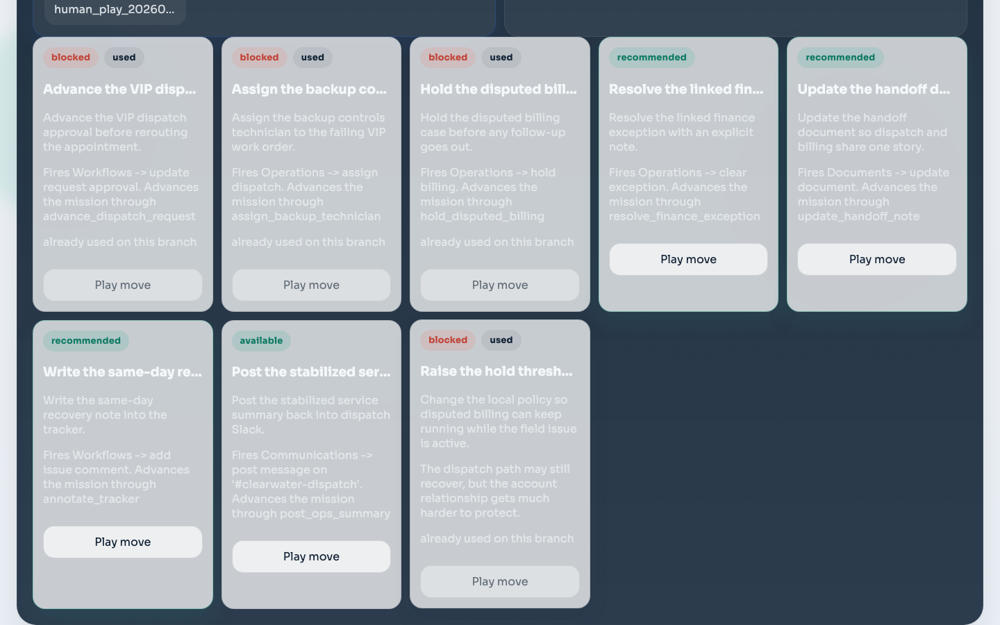

---

## 9. Crisis Tab

The Crisis tab provides structured analysis of what went wrong and why it matters:

- **Current Crisis**: Service Day Collision
- **Why This Matters**: "This is the pressure point most likely to decide whether the company stabilizes or scrambles."
- **Failure Impact**: Miss the SLA, aggravate the dispute, churn risk

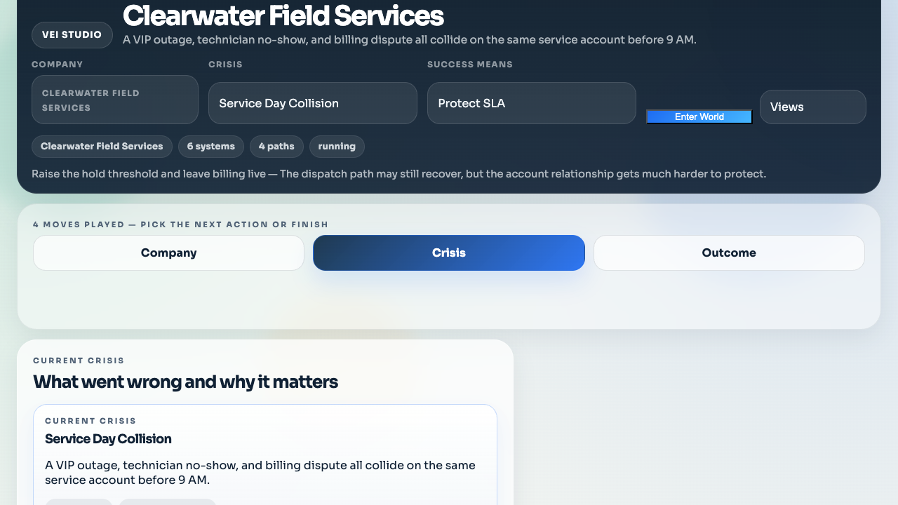

---

## 10. Outcome Tab — Contract Evaluation

The Outcome tab evaluates the full run against the contract:

- **Contract**: fail/pass based on assertions
- **Assertions**: Checked against the selected objective variant
- **Decision audit trail**: Every move recorded with timestamps and policy tags
- **Branch comparison**: Compare alternate paths from the same starting state

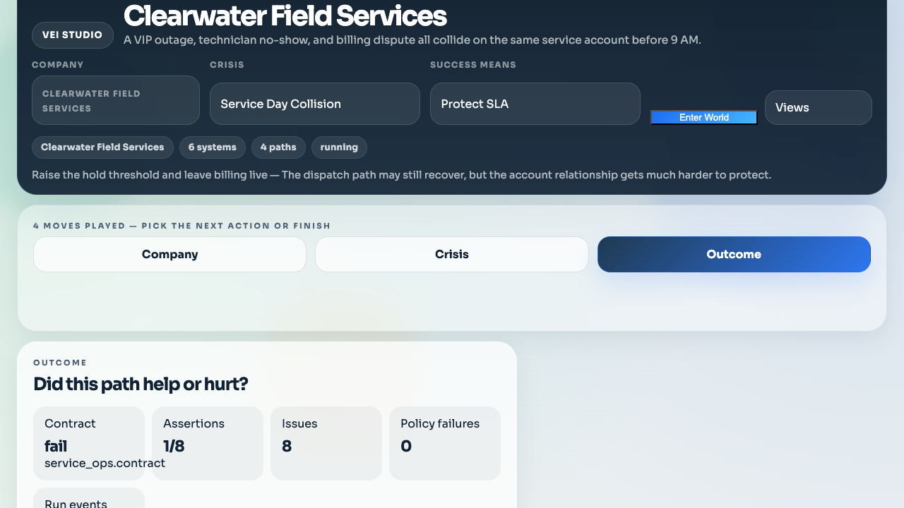

---

## 11. Decision Audit Trail

The decision log shows every action taken during the mission, including policy overrides flagged with amber banners. This gives the operator and any auditor a clear record of which decisions changed the rules.

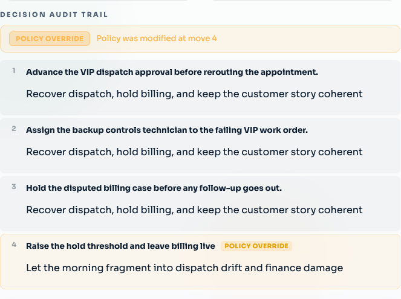

---

## 12. Move Log

The move log under "Recent changes" records the full history of moves played on this branch, with tool names, domains, execution times, and descriptions.

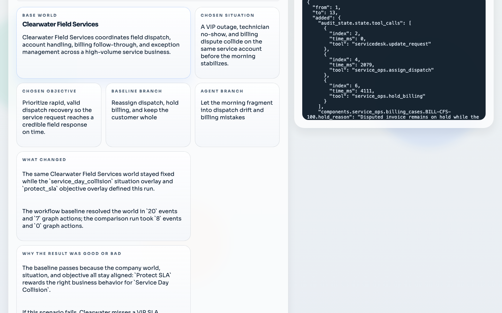

---

## Summary — The Control Plane with Mirror Mode

This walkthrough demonstrates the integrated control plane with mirror mode:

1. **Agent Fleet visibility** — The operator sees their autonomous agents (Dispatch Bot, Billing Bot) alongside system health in the situation room. Agent status, roles, allowed surfaces, and event counts are always visible.

2. **Mirror mode integration** — Agent actions flow through the same twin gateway and appear in the same surfaces as human moves. The control plane treats human and agent actions uniformly.

3. **Weighted scoring by objective** — Protect SLA vs Protect Revenue vs Protect Customer Trust produce different scores for the same actions, because each objective weights assertion categories differently.

4. **Situation room strip** — A 6-cell band gives system health, exceptions, policy posture, approvals, deadline pressure, and risk in one glance.

5. **Policy change ceremony** — Risky moves open a modal with a policy diff table, consequence preview, and explicit Confirm/Cancel.

6. **Governance UX** — Amber chip for risky moves, decision audit trail, policy override callouts, and move log history.

### Running It

```bash
# Standard mode (no mirror agents)
vei quickstart run --world service_ops

# With mirror mode demo agents
vei quickstart run --world service_ops --mirror-demo

# With live connectors (requires VEI_LIVE_SLACK_TOKEN)
vei quickstart run --world service_ops --connector-mode live
```

The Studio UI runs on `http://127.0.0.1:3011` and the Twin Gateway on `http://127.0.0.1:3012`.
