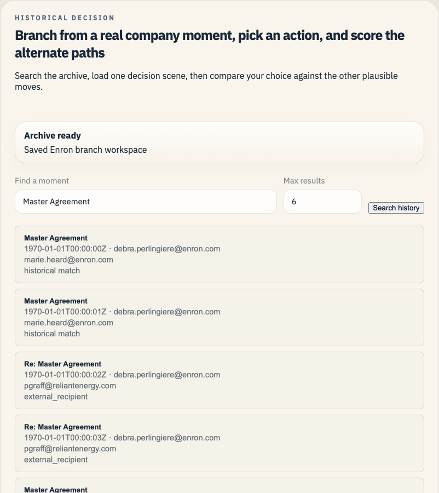
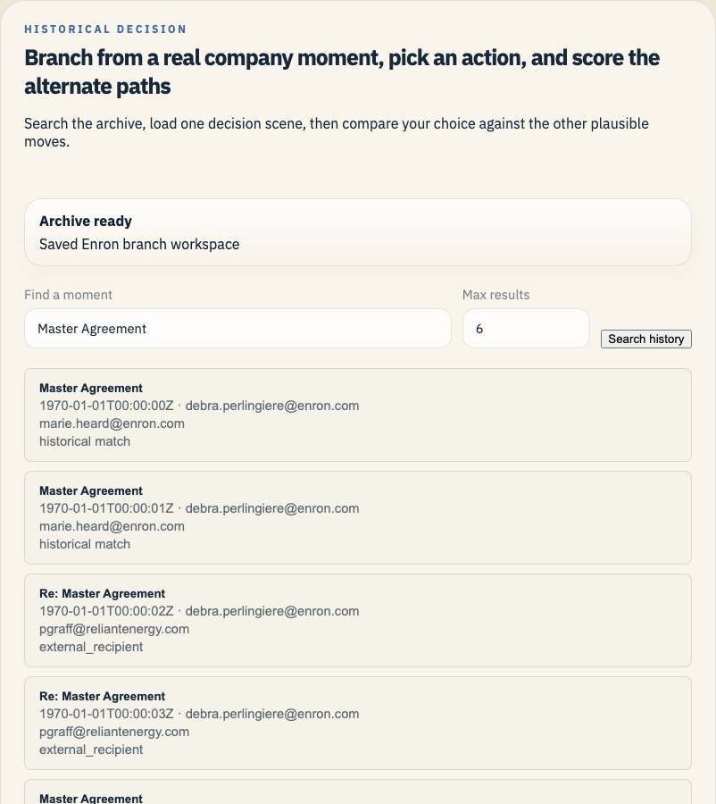

# Historical What-Ifs

VEI now supports a company-history historical what-if workflow for archive-backed datasets such as the Enron Rosetta event tables and normalized multi-source context snapshots.

The flow has five steps:

1. **Normalize** — turn raw company records into a verified `context_snapshot.json` (`vei context normalize`).
2. **Branch** — explore the whole history, pick one exact historical event as the branch point.
3. **Materialize** — build a strict historical workspace with `episode_manifest.json` and optional `whatif_public_context.json`.
4. **Compare** — run the baseline future against one or more counterfactual paths.
5. **Validate** — verify the saved bundle (`python scripts/validate_whatif_artifacts.py`).

Studio supports the same loop directly:

1. search the archive for a real historical moment
2. choose one event from the results
3. materialize the baseline workspace
4. run the counterfactual and inspect the saved comparison bundle
5. validate the resulting bundle

## Why this shape

VEI does not try to turn an entire historical corpus into one giant always-running simulation. That would be slower, heavier, and harder to understand in a demo.

Instead, the system uses two connected layers:

- **Whole-history analysis** for broad questions such as “what would this policy have caught?”
- **Event-level replay** for one chosen moment, where VEI can branch, replay, and compare outcomes inside a normal world workspace

This keeps the whole-history pass deterministic and cheap while still giving us a true replay environment for the interesting moment.

## What gets materialized

When VEI opens a historical episode, it builds a workspace from the selected surface:

- earlier records on that surface become the initial historical state
- the selected event and later historical records become scheduled replay events
- observed participants become identity records
- policy-relevant annotations stay attached for analysis and scoring

The important constraint is honesty:

- VEI keeps mail as mail, chat as chat, and tickets as tickets
- VEI keeps historical excerpts labeled as excerpts when the source data is truncated
- unsupported surfaces stay disabled instead of being faked

## Compare paths

There are two compare paths today:

- **LLM actor continuation**
  - bounded continuation on the affected thread or ticket
- supports mail, Slack or Teams-style chat, and Jira-style ticket comments
- derives shared case ids across those surfaces and attaches linked docs or CRM records when the bundle includes them
  - limited to the known thread participants and allowed targets
  - defaults to `gpt-5-mini` so the interactive run completes quickly and predictably
  - useful for “what would someone have said or done next?”
- **Learned backend forecast (optional, pluggable)**
  - real checkpoint-backed forecast for risk and volume deltas when the local `ARP_Jepa_exp` runtime is available
  - trained on a deterministic local slice of related threads around the chosen branch point, so the forecast stays tied to the exact decision you are changing
  - falls back to the heuristic baseline when that runtime is missing or errors
  - useful for “how much would this likely reduce exposure, escalation, or follow-up volume?”

The heuristic baseline (formerly `e_jepa_proxy`) is a tag-driven heuristic, not a learned model. It is useful as a demo baseline but should not be described as JEPA-like.

Both forecast paths now go through the shared `vei.dynamics` boundary. The what-if experiment flow calls `vei.dynamics.api.get_backend(...)` and the concrete forecast engines (JEPA subprocess, heuristic, reference checkpoint) are plugged in behind the contract via `vei.whatif.dynamics_bridge`. That means swapping or adding a forecast backend does not touch the whatif flow — it registers a new `DynamicsBackend` and updates `.agents.yml`.

On top of the forecast path, VEI now builds a shared business-state readout. That layer translates the forecast into decision language such as outside spread risk, internal handling load, execution delay, commercial position, and approval or escalation pressure. The saved workspace and the saved forecast bundle both carry that readout.

## CLI

```bash
# Whole-history analysis
vei whatif explore \
  --rosetta-dir /path/to/rosetta \
  --scenario compliance_gateway \
  --format markdown

# Search for exact branch points
vei whatif events \
  --rosetta-dir /path/to/rosetta \
  --actor vince.kaminski \
  --query "btu weekly" \
  --flagged-only \
  --format markdown

# Build a replayable episode from one exact event
vei whatif open \
  --rosetta-dir /path/to/rosetta \
  --root _vei_out/whatif/enron_case \
  --event-id evt_1234

# Replay the historical future
vei whatif replay \
  --root _vei_out/whatif/enron_case \
  --tick-ms 600000

# Run the full counterfactual experiment
vei whatif experiment \
  --rosetta-dir /path/to/rosetta \
  --artifacts-root _vei_out/whatif_experiments \
  --label master_agreement_internal_review \
  --event-id evt_1234 \
  --model gpt-5-mini \
  --forecast-backend e_jepa \
  --ejepa-epochs 1 \
  --ejepa-batch-size 64 \
  --counterfactual-prompt "Keep the draft inside Enron, loop in Gerald Nemec for legal review, and hold the outside send until the clean version is approved."
```

## Artifacts

`vei whatif experiment` writes a result bundle that includes:

- experiment result JSON
- experiment overview Markdown
- LLM path JSON
- forecast path JSON
- business-state comparison JSON
- business-state comparison Markdown
- the strict replay workspace used for the run

The forecast bundle is written as `whatif_ejepa_result.json` when the real JEPA path runs, or `whatif_ejepa_proxy_result.json` when the fallback path is used.

This makes it easy to inspect the result in Studio later, compare runs, or hand the output to another tool.

Use `python scripts/validate_whatif_artifacts.py <workspace-or-bundle-path>` after you refresh a saved workspace or a repo-owned example bundle.

The saved bundle that Studio reads has one stable core shape:

- `whatif_experiment_result.json`: combined saved result and artifact pointers
- `whatif_experiment_overview.md`: short human-readable run summary
- `workspace/context_snapshot.json`: normalized company-history bundle for the saved branch
- `workspace/episode_manifest.json`: saved what-if workspace manifest

Optional sidecars are validated when present:

- `whatif_llm_result.json`: saved bounded continuation result
- `whatif_ejepa_result.json` or `whatif_ejepa_proxy_result.json`: saved forecast result
- `whatif_business_state_comparison.json` + `whatif_business_state_comparison.md`: ranked comparison payload and summary when the ranked path is saved

For Enron, VEI also ships a packaged public-company context fixture under `vei/whatif/fixtures/enron_public_context`. Refresh it with `python scripts/prepare_enron_public_context.py`. The current fixture carries 11 dated financial checkpoints and 13 dated public news events from 17 archived public source files, spanning December 31, 1998 through December 2, 2001. VEI slices that fixture to the active Enron email window and then to the chosen branch date before it is shown in Studio, written into the saved episode manifest, added to the LLM counterfactual prompt, or attached to benchmark dossiers.

The same path now works for a new company history bundle. Put the normalized historical source in `context_snapshot.json`. Multi-source snapshots can now branch from mail, Slack or Teams-style chat, and Jira-style ticket history through the same typed what-if path. VEI derives a shared case id from that history, shows earlier cross-surface case activity in the branch scene, and carries that linked operational history plus linked document or CRM records into the saved workspace when the bundle includes them. Put a sidecar `whatif_public_context.json` in the same folder when you want dated public facts in the branch scene, the prompt, and the saved run. Put a research-pack JSON file anywhere on disk when you want a reusable set of held-out branch cases for `vei whatif pack run` or `vei whatif benchmark build`.

## New company onboarding

Bring a new company into the what-if system with three files:

- `context_snapshot.json` for the normalized company history
- `whatif_public_context.json` beside that archive when you want dated public-company context
- `research_pack.json` when you want reusable pack runs or held-out benchmark cases

### From a quickstart / playable workspace

If you already have a quickstart or vertical workspace (e.g. `vei quickstart run --world service_ops --governor-demo`), the company graph is in the blueprint asset, not in a `context_snapshot.json`. Project it into the canonical shape with one command:

```bash
vei whatif export --workspace _vei_out/quickstart \
  --output _vei_out/quickstart/context_snapshot.json
```

The output is a multi-source `context_snapshot.json` that can be passed to `vei whatif events`, `vei whatif open`, and `vei whatif experiment` via `--source company_history --source-dir <path>`.

The normalized company history is the event layer. Put real time-ordered activity there for mail, chat, tickets, and any other surface that can branch or replay. Put state-only sources such as documents or CRM records there too when you want them to show up as linked case context around the branch.

The public-context sidecar is optional. If it is missing, VEI still opens the branch scene, runs the replay, and scores the counterfactual. If the sidecar is present but broken, VEI keeps loading the world and shows an empty public-context slice instead of failing the run.

The history bundle still needs at least one healthy event surface. VEI ignores raw providers that captured with `status: "error"` when it decides whether a bundle is usable for branching and replay.

```bash
# Run a branch experiment on a generic company history bundle
vei whatif experiment \
  --source-dir /path/to/newco/context_snapshot.json \
  --artifacts-root _vei_out/whatif_experiments \
  --label newco_internal_review \
  --event-id msg_123 \
  --forecast-backend e_jepa \
  --counterfactual-prompt "Keep the draft inside NewCo, route it through legal review, and hold the outside send until the clean version is ready."

# Run a reusable case pack from a JSON file
vei whatif pack run \
  --source-dir /path/to/newco/context_snapshot.json \
  --label newco_pack_run \
  --pack-id /path/to/newco/research_pack.json

# Build a held-out benchmark from the same file-backed case pack
vei whatif benchmark build \
  --source-dir /path/to/newco/context_snapshot.json \
  --label newco_benchmark \
  --heldout-pack-id /path/to/newco/research_pack.json
```

## Current Studio flow

The current repo-owned Enron example has two committed layers:

- the saved `Master Agreement` example bundle under `docs/examples/enron-master-agreement-public-context/` for the branch workspace and saved result files
- the packaged public-company context fixture under `vei/whatif/fixtures/enron_public_context` for dated financial and public-news facts

The screenshots below were refreshed from the repo-owned `Master Agreement` bundle under `docs/examples/enron-master-agreement-public-context/`, so a fresh clone can show the same branch point, search it, and inspect the saved comparisons without depending on ignored local output folders.






The public-company panel is its own dated slice. This saved `Master Agreement` branch is on September 27, 2000, so it shows the five financial checkpoints and six public-news rows that were already public by that date.


The repo-owned `Master Agreement` example also carries the saved result panels for the same branch point. The single saved counterfactual keeps the same 84-event horizon, predicts 29 fewer outside sends, and translates that into plain business effects.


The saved ranked comparison then turns that into a real decision view for the same moment: hold for internal review ranks first, a narrow status note ranks second, and a fast-turnaround push loses the containment gain.


## Live Enron display in Studio

Use the repo-owned saved Enron example directly when you want the screen to show Enron itself from a fresh clone.

```bash
vei ui serve \
  --root docs/examples/enron-master-agreement-public-context/workspace \
  --host 127.0.0.1 \
  --port 3055
```

Open `http://127.0.0.1:3055` and stay inside that workspace. This keeps the display tied to the actual Enron branch point and the actual saved result.

The committed example bundle also carries:

- `whatif_experiment_overview.md`
- `whatif_llm_result.json`
- `whatif_ejepa_result.json`
- `whatif_experiment_result.json`
- `whatif_business_state_comparison.md`
- `whatif_business_state_comparison.json`

Unlike a plain saved run (which may omit ranked sidecars), this repo-owned example intentionally includes ranked comparison artifacts as part of the reference story.

Those files live under `docs/examples/enron-master-agreement-public-context/` beside the saved workspace. The branch date is September 27, 2000, so the saved scene shows 5 financial checkpoints and 6 public-news items. Use the real Rosetta archive when you want whole-history Enron search or a new run from the full corpus.

Refresh the repo-owned example and validate it before you report a change:

```bash
python scripts/build_enron_business_state_example.py
python scripts/validate_whatif_artifacts.py docs/examples/enron-master-agreement-public-context
```

## Enron business-outcome benchmark

The historical replay flow above is for one branch point and one saved comparison. The Enron benchmark is for repeated measurement across many branch points.

This benchmark answers a different question:

- given only the history before the branch point
- and one structured candidate action
- what later business-relevant email evidence becomes more or less likely

The benchmark keeps the older replay and ranked what-if flows intact. It adds a separate benchmark path for business-facing proxy outcomes:

- `enterprise_risk`
- `commercial_position_proxy`
- `org_strain_proxy`
- `stakeholder_trust`
- `execution_drag`

Those scores come from later email evidence that the archive can actually support:

- outside spread
- legal burden
- executive heat
- coordination load
- decision drag
- trust or repair language
- conflict heat
- artifact churn

All trained model families use the same boundary for this benchmark:

- pre-branch thread history only
- structured candidate action only

The held-out Enron dossiers now include dated public financial checkpoints and public news items that were already known by the branch date. That public context helps the judge and the audit workflow. It does not change the model-training contract in this pass.

The matched-input benchmark study now gives `jepa_latent` and `full_context_transformer` the same pre-branch event sequence, summary features, and action schema. That makes the main rerun a clean model comparison instead of a mixed input comparison.

### Benchmark commands

```bash
# Build the factual dataset and the held-out Enron case pack
vei whatif benchmark build \
  --rosetta-dir /path/to/rosetta \
  --artifacts-root _vei_out/whatif_benchmarks/branch_point_ranking_v2 \
  --label enron_business_outcome_public_context_20260412

# Train one model family
vei whatif benchmark train \
  --root _vei_out/whatif_benchmarks/branch_point_ranking_v2/enron_business_outcome_public_context_20260412 \
  --model-id jepa_latent

# Judge the held-out counterfactual cases from dossiers only
vei whatif benchmark judge \
  --root _vei_out/whatif_benchmarks/branch_point_ranking_v2/enron_business_outcome_public_context_20260412 \
  --model gpt-4.1-mini

# Evaluate the trained model against factual futures and judged rankings
vei whatif benchmark eval \
  --root _vei_out/whatif_benchmarks/branch_point_ranking_v2/enron_business_outcome_public_context_20260412 \
  --model-id jepa_latent \
  --judged-rankings-path _vei_out/whatif_benchmarks/branch_point_ranking_v2/enron_business_outcome_public_context_20260412/judge_result.json \
  --audit-records-path /path/to/completed_audit_records.json

# Run the matched-input study across multiple models and seeds
vei whatif benchmark study \
  --root _vei_out/whatif_benchmarks/branch_point_ranking_v2/enron_business_outcome_public_context_20260412 \
  --label matched_input_public_context_20260412 \
  --model-id jepa_latent \
  --model-id full_context_transformer \
  --model-id treatment_transformer \
  --seed 42042 \
  --seed 42043 \
  --seed 42044 \
  --seed 42045 \
  --seed 42046 \
  --epochs 2
```

### What gets written

`vei whatif benchmark build` writes:

- factual train, validation, and test rows built from observed Enron futures
- a held-out Enron case pack
- one dossier per case and per business objective
- a judged-ranking template
- an audit template

`vei whatif benchmark judge` writes:

- `judge_result.json`
- `audit_queue.json`

`vei whatif benchmark eval` writes:

- factual forecasting metrics
- judged counterfactual ranking metrics
- audit coverage and agreement metrics
- rollout stress metrics only as a separate section

`vei whatif benchmark study` writes:

- one aggregate JSON result
- one Markdown overview
- one seeded run folder per model under `studies/<label>/runs/...`

### Current model state

The current saved Enron public-context build uses 24 held-out cases with 4 candidate actions each. The headline result now comes from the matched-input study rerun over that build rather than from the older single-run comparison.

The held-out dossiers now also carry the dated Enron public-company backdrop that was already public by each branch date. That richer context is for replay, judging, and audit review. The model-training inputs stay the same in this pass.

On the current 5-seed, 2-epoch matched-input rerun, the held-out decision checks came out like this:

- `jepa_latent`: `80.2/120` mean, `0.668 +/- 0.012`
- `full_context_transformer`: `79.4/120` mean, `0.662 +/- 0.031`
- `treatment_transformer`: `68.2/120` mean, `0.568 +/- 0.117`

On the factual question of whether anything goes outside after the branch point, all three models stayed tightly grouped around `0.98` AUROC: `0.981` for `jepa_latent`, `0.982` for `full_context_transformer`, and `0.980` for `treatment_transformer`.

The main point is that the fair rerun still favors the JEPA-style path on the Enron decision checks once the models read the same pre-branch contract and the result is averaged across seeds, while the treatment transformer shows the widest spread from seed to seed.

### Important constraint

This benchmark stays honest about the source data. Enron email can support business proxies. It does not support true profit ground truth or true HR outcome ground truth.
