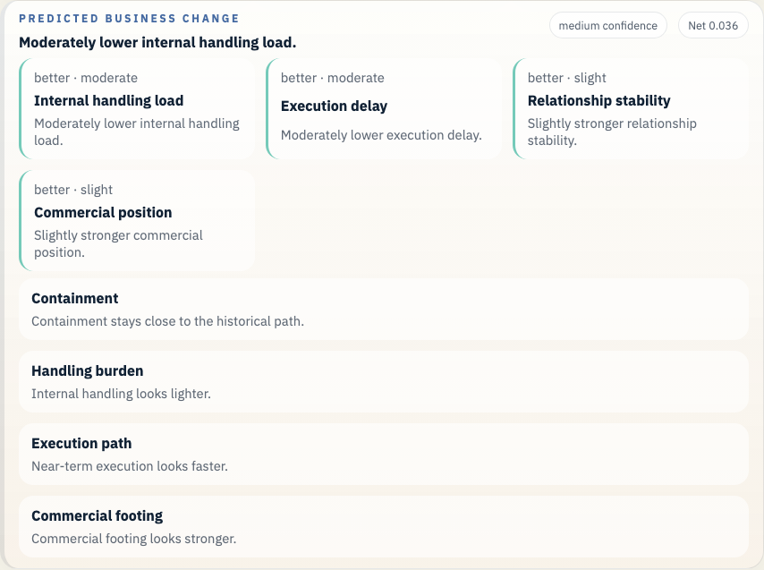
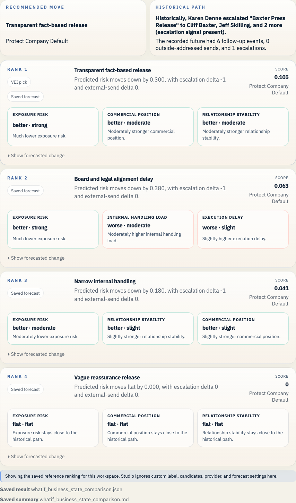

# Enron Baxter Press Release Example

This is the crisis-communications proof case. It shows a real public-facing branch where messaging quality and timing both matter.

## Open It In Studio

```bash
vei ui serve \
  --root /Users/rohit/Documents/Workspace/Coding/digital-enterprise-twin/docs/examples/enron-baxter-press-release/workspace \
  --host 127.0.0.1 \
  --port 3055
```

Open `http://127.0.0.1:3055`.





## Branch Point

- The Cliff Baxter press-release loop is active and the company has to decide how transparent, delayed, or reassuring the public message should be.

## What Actually Happened

- The communications loop moved through a tight internal chain while the company shaped how much to say and how fast to say it.

## Actions We Can Take

- **Transparent fact-based release**: Say only what is known and keep the wording factual.
- **Board and legal alignment delay**: Delay briefly for tighter internal alignment before releasing.
- **Vague reassurance release**: Release fast, but lean on vague reassurance.
- **Narrow internal handling**: Keep the matter tightly internal and delay the public line.

## Predicted Effect On The Company

- Recorded future events after the historical branch: 6
- Current top-ranked action: Transparent fact-based release
- Short readout: Much lower exposure risk.
- Legal and regulatory exposure: improves (0.489 -> 0.366)
- Disclosure and stakeholder trust: improves (0.556 -> 0.657)
- Commercial damage: improves (0.431 -> 0.33)
- Internal execution drag: improves (0.377 -> 0.318)

## Why This Branch Matters

This is a better public-message case than Watkins for technical proof. It still has real stakes, but it also has a clearer downstream tail and a public-facing branch that readers understand quickly.

It gives the proof set a crisis-communications case that is about more than pure suppression versus escalation.

## Bundle Facts

- Saved branch scene: 30 prior events and 6 recorded future events
- Public-company slice at 2001-05-02: 9 financial checkpoints, 8 public news items, 825 market checkpoints, 3 credit checkpoints, and 0 regulatory checkpoints
- Prior timeline source families: credit, disclosure, filing, financial, market, news
- Prior timeline domains: governance, obs_graph
- Bundle role: `proof`
- Saved LLM path: Hold the release for board and legal alignment, keep the language factual, and avoid broad reassurance until the internal record is stable.
- Saved forecast file: `whatif_reference_result.json`

## Saved Files

- `workspace/`: saved workspace you can open in Studio
- `whatif_experiment_overview.md`: short human-readable run summary
- `whatif_experiment_result.json`: saved combined result for the example bundle
- `whatif_llm_result.json`: bounded message-path result
- `whatif_reference_result.json`: saved forecast result
- `whatif_business_state_comparison.md`: ranked comparison in business language
- `whatif_business_state_comparison.json`: structured comparison payload
- `enron_story_overview.md`: presenter-facing branch summary
- `enron_story_manifest.json`: structured demo manifest
- `enron_exports_preview.json`: export preview for timeline and forecast artifacts
- `enron_presentation_manifest.json`: presentation beat manifest
- `enron_presentation_guide.md`: operator guide for bundle demos

## Other Enron Examples

- [Enron Master Agreement Example](../enron-master-agreement-public-context/README.md)
- [Enron PG&E Power Deal Example](../enron-pge-power-deal/README.md)
- [Enron California Crisis Strategy Example](../enron-california-crisis-strategy/README.md)
- [Enron Braveheart Forward Example](../enron-braveheart-forward/README.md)
- [Enron Watkins Follow-up Example](../enron-watkins-follow-up/README.md)
- [Enron Q3 Disclosure Review Example](../enron-q3-disclosure-review/README.md)
- [Enron Skilling Resignation Materials Example](../enron-skilling-resignation-materials/README.md)

## Refresh

```bash
python scripts/build_enron_example_bundles.py --bundle enron-baxter-press-release
python scripts/validate_whatif_artifacts.py docs/examples/enron-baxter-press-release
python scripts/capture_enron_bundle_screenshots.py --bundle enron-baxter-press-release
```

## Constraint

This repo now carries a small checked-in Enron Rosetta sample for the saved bundles and smoke checks. Fetch the full archive with `make fetch-enron-full` when you want full training, full benchmark builds, or full archive validation.

The macro heads in these saved bundles stay advisory context beside the email-path evidence. See [the current calibration report](../../../studies/macro_calibration_enron_v1/calibration_report.md) before making any stronger claim.
