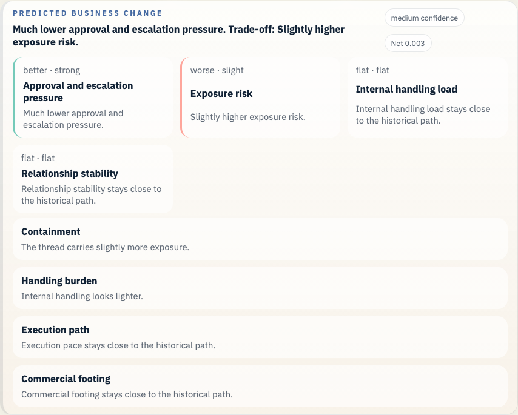
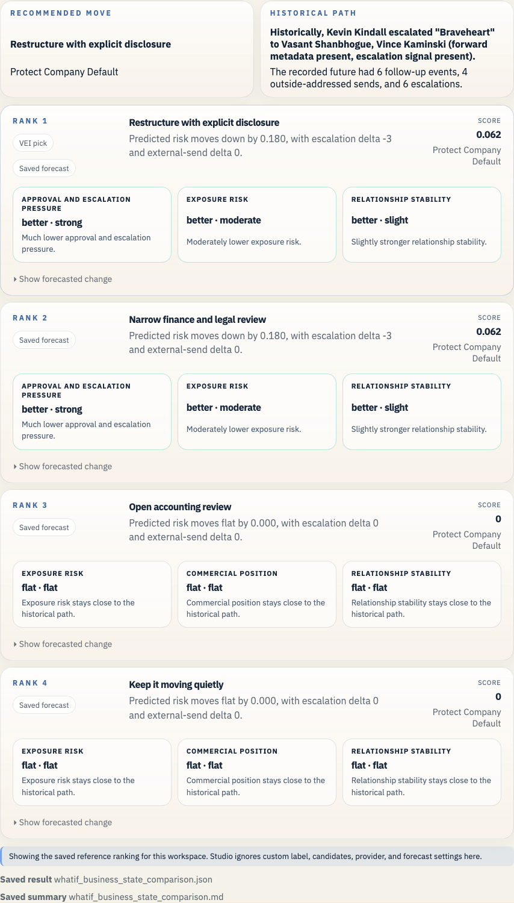

# Enron Braveheart Forward Example

This is the accounting-structure proof case. It is denser than the others, but it shows the system handling a real internal financing and disclosure fork.

## Open It In Studio

```bash
vei ui serve \
  --root /Users/rohit/Documents/Workspace/Coding/digital-enterprise-twin/docs/examples/enron-braveheart-forward/workspace \
  --host 127.0.0.1 \
  --port 3055
```

Open `http://127.0.0.1:3055`.





## Branch Point

- The Braveheart structure is being forwarded through the valuation and review chain as the company decides whether to reopen the accounting question.

## What Actually Happened

- The thread kept moving through a narrow finance and legal chain tied to the larger broadband and structure story.

## Actions We Can Take

- **Open accounting review**: Reopen the accounting question formally before moving.
- **Restructure with explicit disclosure**: Keep the transaction alive, but change the structure and disclosure.
- **Narrow finance and legal review**: Use a narrow internal review before broadening the loop.
- **Keep it moving quietly**: Preserve momentum and keep the structure moving quietly.

## Predicted Effect On The Company

- Recorded future events after the historical branch: 6
- Current top-ranked action: Restructure with explicit disclosure
- Short readout: Much lower approval and escalation pressure.
- Legal and regulatory exposure: improves (0.696 -> 0.572)
- Disclosure and stakeholder trust: improves (0.541 -> 0.611)
- Commercial damage: improves (0.414 -> 0.36)
- Internal execution drag: worsens (0.101 -> 0.107)

## Why This Branch Matters

This case is stronger than a simple safe-versus-risky story. A full stop, a restructure, a narrow review, and quiet continuation each carry different costs.

It gives the proof set a hard accounting and disclosure branch that is not just a message-routing problem.

## Bundle Facts

- Saved branch scene: 30 prior events and 6 recorded future events
- Public-company slice at 2000-12-19: 6 financial checkpoints, 6 public news items, 735 market checkpoints, 0 credit checkpoints, and 0 regulatory checkpoints
- Prior timeline source families: disclosure, filing, financial, mail, market, news
- Prior timeline domains: governance, internal, obs_graph
- Bundle role: `proof`
- Saved LLM path: Open an accounting review on Braveheart, preserve the working record, and require explicit disclosure review before the structure keeps moving.
- Saved forecast file: `whatif_reference_result.json`

## Saved Files

- `workspace/`: saved workspace you can open in Studio
- `whatif_experiment_overview.md`: short human-readable run summary
- `whatif_experiment_result.json`: saved combined result for the example bundle
- `whatif_llm_result.json`: bounded message-path result
- `whatif_reference_result.json`: saved forecast result
- `whatif_business_state_comparison.md`: ranked comparison in business language
- `whatif_business_state_comparison.json`: structured comparison payload
- `enron_story_overview.md`: presenter-facing branch summary
- `enron_story_manifest.json`: structured demo manifest
- `enron_exports_preview.json`: export preview for timeline and forecast artifacts
- `enron_presentation_manifest.json`: presentation beat manifest
- `enron_presentation_guide.md`: operator guide for bundle demos

## Other Enron Examples

- [Enron Master Agreement Example](../enron-master-agreement-public-context/README.md)
- [Enron PG&E Power Deal Example](../enron-pge-power-deal/README.md)
- [Enron California Crisis Strategy Example](../enron-california-crisis-strategy/README.md)
- [Enron Baxter Press Release Example](../enron-baxter-press-release/README.md)
- [Enron Watkins Follow-up Example](../enron-watkins-follow-up/README.md)
- [Enron Q3 Disclosure Review Example](../enron-q3-disclosure-review/README.md)
- [Enron Skilling Resignation Materials Example](../enron-skilling-resignation-materials/README.md)

## Refresh

```bash
python scripts/build_enron_example_bundles.py --bundle enron-braveheart-forward
python scripts/validate_whatif_artifacts.py docs/examples/enron-braveheart-forward
python scripts/capture_enron_bundle_screenshots.py --bundle enron-braveheart-forward
```

## Constraint

This repo now carries a small checked-in Enron Rosetta sample for the saved bundles and smoke checks. Fetch the full archive with `make fetch-enron-full` when you want full training, full benchmark builds, or full archive validation.

The macro heads in these saved bundles stay advisory context beside the email-path evidence. See [the current calibration report](../../../studies/macro_calibration_enron_v1/calibration_report.md) before making any stronger claim.
