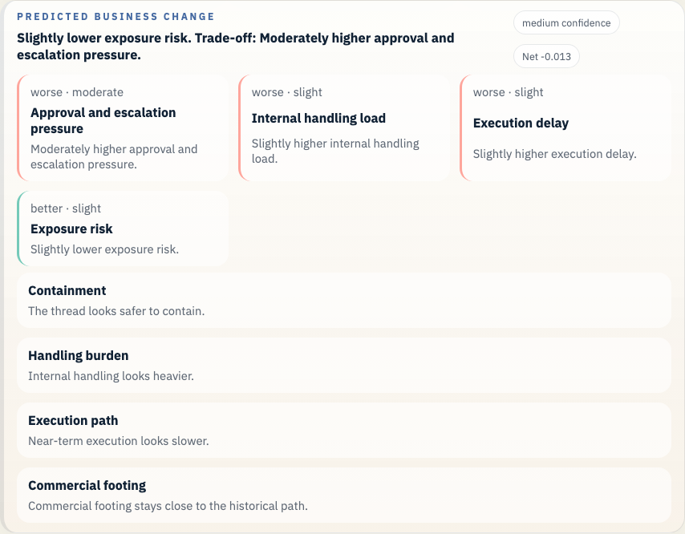
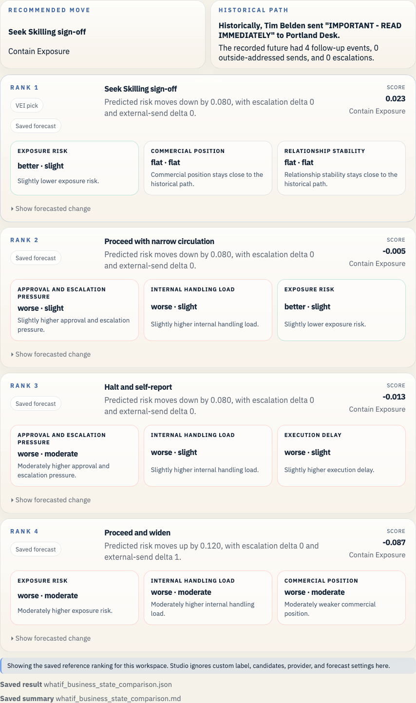

# Enron California Crisis Strategy Example

This example moves the branch point into the California power-crisis conduct and lets the saved comparison sit inside the FERC and refund timeline that now ships with the repo.

## Open It In Studio

```bash
vei ui serve \
  --root docs/examples/enron-california-crisis-strategy/workspace \
  --host 127.0.0.1 \
  --port 3055
```

Open `http://127.0.0.1:3055`.





## Why This Branch Matters

This branch matters because the desk still has room to choose between legal containment and continued conduct after the preservation order lands. The saved comparison turns that into a plain choice about halting, documenting, or pushing through.

The FERC and refund timeline gives the branch a wider public frame, but the macro panel remains advisory context beside the preserved email evidence and the ranked decision path.

## What This Example Covers

- Historical branch point: Tim Belden's desk receives a preservation order tied to the California crisis while the trading strategy is still active.
- Saved branch scene: 2 prior messages and 4 recorded future events
- Public-company slice at 2000-12-15: 6 financial checkpoints, 6 public news items, 733 market checkpoints, 0 credit checkpoints, and 0 regulatory checkpoints
- Saved LLM path: Pause the strategy, preserve the record, alert legal and compliance, and prepare a self-report path instead of continuing the trading play.
- Saved forecast file: `whatif_heuristic_baseline_result.json`
- Business-state readout: Slightly lower exposure risk. Trade-off: Moderately higher approval and escalation pressure.
- Top ranked candidate: Seek Skilling sign-off

## Saved Files

- `workspace/`: saved workspace you can open in Studio
- `whatif_experiment_overview.md`: short human-readable run summary
- `whatif_experiment_result.json`: saved combined result for the example bundle
- `whatif_llm_result.json`: bounded message-path result
- `whatif_heuristic_baseline_result.json`: saved forecast result
- `whatif_business_state_comparison.md`: ranked comparison in business language
- `whatif_business_state_comparison.json`: structured comparison payload

## Other Enron Examples

- [Enron Master Agreement Example](../enron-master-agreement-public-context/README.md)
- [Enron Watkins Follow-up Example](../enron-watkins-follow-up/README.md)
- [Enron PG&E Power Deal Example](../enron-pge-power-deal/README.md)

## Refresh

```bash
python scripts/build_enron_example_bundles.py --bundle enron-california-crisis-strategy
python scripts/validate_whatif_artifacts.py docs/examples/enron-california-crisis-strategy
python scripts/capture_enron_bundle_screenshots.py --bundle enron-california-crisis-strategy
```

## Constraint

This repo now carries the Rosetta parquet archive, the source cache, and the raw Enron mail tar under `data/enron/`, so a fresh clone can open these saved examples and rebuild them without reaching into a sibling checkout.

The macro heads in these saved bundles stay advisory context beside the email-path evidence. See [the current calibration report](../../../studies/macro_calibration_enron_v1/calibration_report.md) before making any stronger claim.
