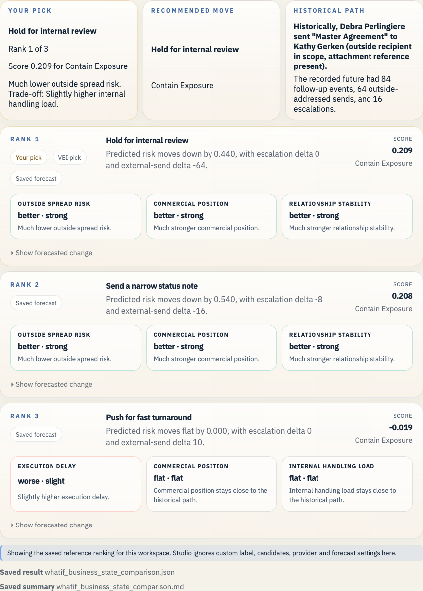

# Enron Master Agreement Example

This example keeps the original Master Agreement branch point in the repo, now with the wider Enron macro context and the newer stock, credit, and regulatory fixtures attached.

## Open It In Studio

```bash
vei ui serve \
  --root /Users/rohit/Documents/Workspace/Coding/digital-enterprise-twin/docs/examples/enron-master-agreement-public-context/workspace \
  --host 127.0.0.1 \
  --port 3055
```

Open `http://127.0.0.1:3055`.




## Why This Branch Matters

This branch is the clearest procedural example in the Enron set. One contract draft is ready to go out, and the decision is whether to keep the document inside legal review or widen the outside loop.

The wider public-company panel puts that narrow legal choice inside the larger Enron arc. The macro heads stay in the scene as dated context only, because the current calibration report is still weak.

## What This Example Covers

- Historical branch point: Debra Perlingiere is about to send the Master Agreement draft to Cargill on September 27, 2000.
- Saved branch scene: 30 prior events and 84 recorded future events
- Public-company slice at 2000-09-27: 5 financial checkpoints, 6 public news items, 679 market checkpoints, 0 credit checkpoints, and 0 regulatory checkpoints
- Prior timeline source families: disclosure, filing, financial, mail, market, news
- Prior timeline domains: governance, internal, obs_graph
- Saved LLM path: Keep the draft inside Enron, ask Gerald Nemec and Sara Shackleton for review, and hold the outside send.
- Saved forecast file: `whatif_reference_result.json`
- Business-state readout: Slightly lower internal handling load. Trade-off: Slightly higher outside spread risk.
- Top ranked candidate: Hold for internal review

## Saved Files

- `workspace/`: saved workspace you can open in Studio
- `whatif_experiment_overview.md`: short human-readable run summary
- `whatif_experiment_result.json`: saved combined result for the example bundle
- `whatif_llm_result.json`: bounded message-path result
- `whatif_reference_result.json`: saved forecast result
- `whatif_business_state_comparison.md`: ranked comparison in business language
- `whatif_business_state_comparison.json`: structured comparison payload
- `enron_story_overview.md`: presenter-facing branch summary
- `enron_story_manifest.json`: structured demo manifest
- `enron_exports_preview.json`: export preview for timeline and forecast artifacts
- `enron_presentation_manifest.json`: presentation beat manifest
- `enron_presentation_guide.md`: operator guide for bundle demos

## Other Enron Examples

- [Enron Watkins Follow-up Example](../enron-watkins-follow-up/README.md)
- [Enron California Crisis Strategy Example](../enron-california-crisis-strategy/README.md)
- [Enron PG&E Power Deal Example](../enron-pge-power-deal/README.md)

## Bankruptcy Arc Timeline

See [timeline_arc.md](timeline_arc.md) for the dated public timeline and [the rendered timeline image](../../assets/enron-whatif/enron-bankruptcy-arc-timeline.png) for the visual version that places this branch beside the PG&E, California, and Watkins follow-up examples.

## Refresh

```bash
python scripts/build_enron_example_bundles.py --bundle enron-master-agreement-public-context
python scripts/validate_whatif_artifacts.py docs/examples/enron-master-agreement-public-context
python scripts/capture_enron_bundle_screenshots.py --bundle enron-master-agreement-public-context
```

## Constraint

This repo now carries the Rosetta parquet archive, the source cache, and the raw Enron mail tar under `data/enron/`, so a fresh clone can open these saved examples and rebuild them without reaching into a sibling checkout.

The macro heads in these saved bundles stay advisory context beside the email-path evidence. See [the current calibration report](../../../studies/macro_calibration_enron_v1/calibration_report.md) before making any stronger claim.
