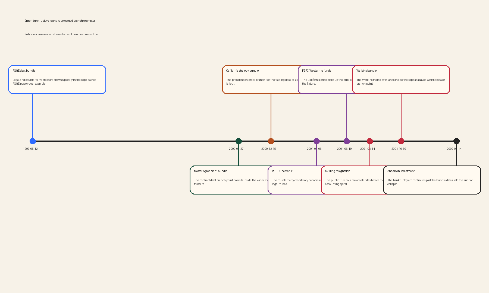

# Enron timeline arc

The saved Enron bundles now cover four different branch points inside the broader Enron collapse story.

## Arc

- 1999-05-12 — **PG&E deal bundle**: Legal and counterparty pressure shows up early in the repo-owned PG&E power-deal example.
- 2000-09-27 — **Master Agreement bundle**: The contract draft branch point now sits inside the wider market and trust arc.
- 2000-12-15 — **California strategy bundle**: The preservation-order branch ties the trading desk to later regulatory fallout.
- 2001-04-06 — **PG&E Chapter 11**: The counterparty credit story becomes impossible to treat as a purely legal thread.
- 2001-06-19 — **FERC Western refunds**: The California crisis picks up the public regulatory backdrop tracked in the fixture.
- 2001-08-14 — **Skilling resignation**: The public trust collapse accelerates before the late-October accounting spiral.
- 2001-10-30 — **Watkins bundle**: The Watkins memo path lands inside the repo as a saved whistleblower branch point.
- 2002-03-14 — **Andersen indictment**: The bankruptcy arc continues past the bundle dates into the auditor collapse.

## Reading order

- Start with the PG&E power-deal bundle for the early counterparty-credit thread.
- Move to the Master Agreement bundle for the contract-control branch inside the operating company.
- Open the California strategy bundle for the trading and regulatory path.
- End with the Watkins memo bundle for the late trust and accounting warning path.

