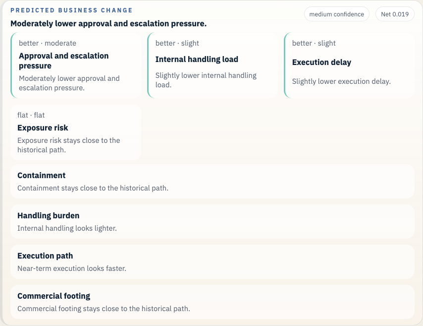
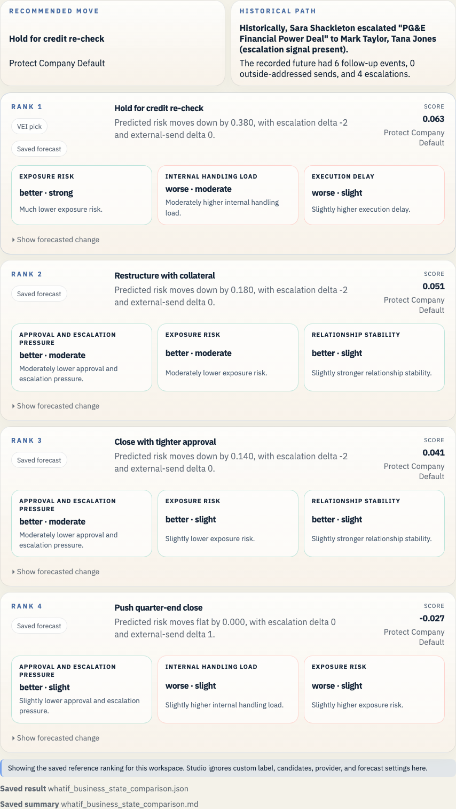

# Enron PG&E Power Deal Example

This is the clean commercial judgment case. It puts a real counterparty decision under credit pressure on the same saved timeline and forecast surface.

## Open It In Studio

```bash
vei ui serve \
  --root /Users/rohit/Documents/Workspace/Coding/digital-enterprise-twin/docs/examples/enron-pge-power-deal/workspace \
  --host 127.0.0.1 \
  --port 3055
```

Open `http://127.0.0.1:3055`.





## Branch Point

- Sara Shackleton is moving a PG&E financial power deal while the counterparty credit picture is deteriorating.

## What Actually Happened

- The deal thread kept moving through the legal and commercial loop while the wider PG&E situation worsened.

## Actions We Can Take

- **Hold for credit re-check**: Pause the deal and re-check counterparty credit before moving.
- **Restructure with collateral**: Keep the deal alive, but rewrite the risk terms.
- **Close with tighter approval**: Keep momentum, but require a visibly tighter approval path.
- **Push quarter-end close**: Favor speed and quarter-end timing over extra credit review.

## Predicted Effect On The Company

- Recorded future events after the historical branch: 6
- Current top-ranked action: Hold for credit re-check
- Short readout: Much lower exposure risk. Trade-off: Moderately higher internal handling load.
- Legal and regulatory exposure: improves (0.509 -> 0.358)
- Disclosure and stakeholder trust: improves (0.615 -> 0.674)
- Commercial damage: improves (0.362 -> 0.306)
- Internal execution drag: worsens (0.197 -> 0.294)

## Why This Branch Matters

This case is strong because more than one move looks plausible. The question is not only safety. The question is whether Enron should slow down, restructure, or still push the deal through.

It also gives the proof set a commercial and credit branch instead of only legal or governance branches.

## Bundle Facts

- Saved branch scene: 30 prior events and 6 recorded future events
- Public-company slice at 1999-05-12: 1 financial checkpoints, 0 public news items, 335 market checkpoints, 0 credit checkpoints, and 0 regulatory checkpoints
- Prior timeline source families: disclosure, financial, market
- Prior timeline domains: governance, obs_graph
- Bundle role: `proof`
- Saved LLM path: Hold the deal until PG&E credit is rechecked, ask for collateral, and keep legal and credit on one internal review loop.
- Saved forecast file: `whatif_reference_result.json`

## Saved Files

- `workspace/`: saved workspace you can open in Studio
- `whatif_experiment_overview.md`: short human-readable run summary
- `whatif_experiment_result.json`: saved combined result for the example bundle
- `whatif_llm_result.json`: bounded message-path result
- `whatif_reference_result.json`: saved forecast result
- `whatif_business_state_comparison.md`: ranked comparison in business language
- `whatif_business_state_comparison.json`: structured comparison payload
- `enron_story_overview.md`: presenter-facing branch summary
- `enron_story_manifest.json`: structured demo manifest
- `enron_exports_preview.json`: export preview for timeline and forecast artifacts
- `enron_presentation_manifest.json`: presentation beat manifest
- `enron_presentation_guide.md`: operator guide for bundle demos

## Other Enron Examples

- [Enron Master Agreement Example](../enron-master-agreement-public-context/README.md)
- [Enron California Crisis Strategy Example](../enron-california-crisis-strategy/README.md)
- [Enron Baxter Press Release Example](../enron-baxter-press-release/README.md)
- [Enron Braveheart Forward Example](../enron-braveheart-forward/README.md)
- [Enron Watkins Follow-up Example](../enron-watkins-follow-up/README.md)
- [Enron Q3 Disclosure Review Example](../enron-q3-disclosure-review/README.md)
- [Enron Skilling Resignation Materials Example](../enron-skilling-resignation-materials/README.md)

## Refresh

```bash
python scripts/build_enron_example_bundles.py --bundle enron-pge-power-deal
python scripts/validate_whatif_artifacts.py docs/examples/enron-pge-power-deal
python scripts/capture_enron_bundle_screenshots.py --bundle enron-pge-power-deal
```

## Constraint

This repo now carries a small checked-in Enron Rosetta sample for the saved bundles and smoke checks. Fetch the full archive with `make fetch-enron-full` when you want full training, full benchmark builds, or full archive validation.

The macro heads in these saved bundles stay advisory context beside the email-path evidence. See [the current calibration report](../../../studies/macro_calibration_enron_v1/calibration_report.md) before making any stronger claim.
