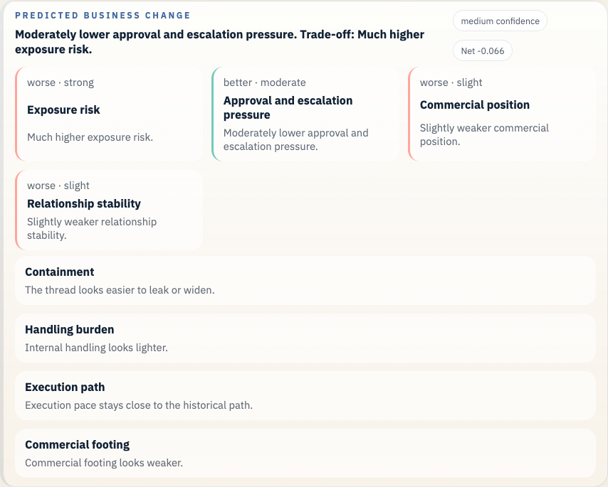
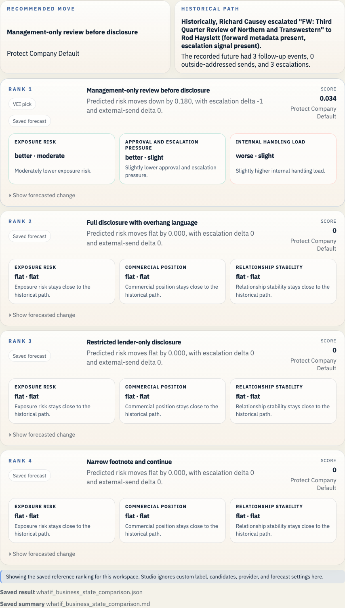

# Enron Q3 Disclosure Review Example

This is the disclosure narrative case. It makes the October 2001 review path legible without relying on a single whistleblower note.

## Open It In Studio

```bash
vei ui serve \
  --root /Users/rohit/Documents/Workspace/Coding/digital-enterprise-twin/docs/examples/enron-q3-disclosure-review/workspace \
  --host 127.0.0.1 \
  --port 3055
```

Open `http://127.0.0.1:3055`.





## Branch Point

- Third-quarter review material is moving while the company is deciding how much to say about the growing accounting and liquidity overhang.

## What Actually Happened

- The review material kept moving through management, finance, and legal during the disclosure crisis.

## Actions We Can Take

- **Full disclosure with overhang language**: Use fuller public language about the overhang.
- **Restricted lender-only disclosure**: Tell the lenders more than the broader public draft.
- **Management-only review before disclosure**: Delay the broader language for another management review pass.
- **Narrow footnote and continue**: Keep the language narrow and continue.

## Predicted Effect On The Company

- Recorded future events after the historical branch: 3
- Current top-ranked action: Management-only review before disclosure
- Short readout: Moderately lower exposure risk. Trade-off: Slightly higher internal handling load.
- Legal and regulatory exposure: improves (0.537 -> 0.448)
- Disclosure and stakeholder trust: improves (0.647 -> 0.682)
- Commercial damage: improves (0.297 -> 0.269)
- Internal execution drag: worsens (0.104 -> 0.153)

## Why This Branch Matters

This case is useful because two or three options can look defensible at first glance. That makes it a better narrative example for explaining why ranking the actions matters.

It also sits closer to public disclosure mechanics than Watkins does.

## Bundle Facts

- Saved branch scene: 36 prior events and 3 recorded future events
- Public-company slice at 2001-10-31: 11 financial checkpoints, 14 public news items, 945 market checkpoints, 4 credit checkpoints, and 1 regulatory checkpoints
- Prior timeline source families: credit, disclosure, filing, financial, governance, news, regulatory
- Prior timeline domains: governance, obs_graph
- Bundle role: `narrative`
- Saved LLM path: Open the review with fuller disclosure language about the overhang, tighten the internal record, and route the draft through disclosure counsel.
- Saved forecast file: `whatif_reference_result.json`

## Saved Files

- `workspace/`: saved workspace you can open in Studio
- `whatif_experiment_overview.md`: short human-readable run summary
- `whatif_experiment_result.json`: saved combined result for the example bundle
- `whatif_llm_result.json`: bounded message-path result
- `whatif_reference_result.json`: saved forecast result
- `whatif_business_state_comparison.md`: ranked comparison in business language
- `whatif_business_state_comparison.json`: structured comparison payload
- `enron_story_overview.md`: presenter-facing branch summary
- `enron_story_manifest.json`: structured demo manifest
- `enron_exports_preview.json`: export preview for timeline and forecast artifacts
- `enron_presentation_manifest.json`: presentation beat manifest
- `enron_presentation_guide.md`: operator guide for bundle demos

## Other Enron Examples

- [Enron Master Agreement Example](../enron-master-agreement-public-context/README.md)
- [Enron PG&E Power Deal Example](../enron-pge-power-deal/README.md)
- [Enron California Crisis Strategy Example](../enron-california-crisis-strategy/README.md)
- [Enron Baxter Press Release Example](../enron-baxter-press-release/README.md)
- [Enron Braveheart Forward Example](../enron-braveheart-forward/README.md)
- [Enron Watkins Follow-up Example](../enron-watkins-follow-up/README.md)
- [Enron Skilling Resignation Materials Example](../enron-skilling-resignation-materials/README.md)

## Refresh

```bash
python scripts/build_enron_example_bundles.py --bundle enron-q3-disclosure-review
python scripts/validate_whatif_artifacts.py docs/examples/enron-q3-disclosure-review
python scripts/capture_enron_bundle_screenshots.py --bundle enron-q3-disclosure-review
```

## Constraint

This repo now carries a small checked-in Enron Rosetta sample for the saved bundles and smoke checks. Fetch the full archive with `make fetch-enron-full` when you want full training, full benchmark builds, or full archive validation.

The macro heads in these saved bundles stay advisory context beside the email-path evidence. See [the current calibration report](../../../studies/macro_calibration_enron_v1/calibration_report.md) before making any stronger claim.
