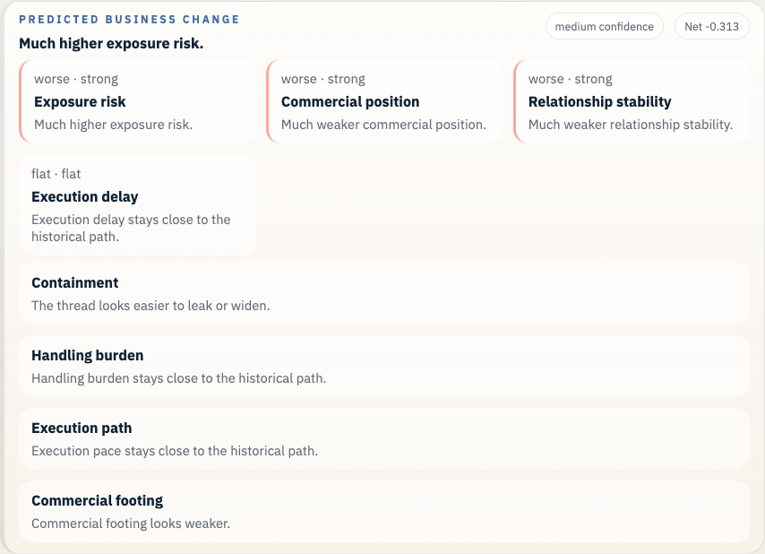
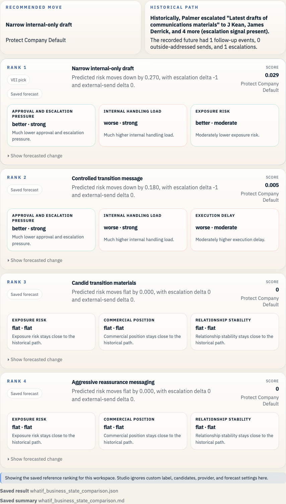

# Enron Skilling Resignation Materials Example

This is the executive-transition narrative case. It shows the same saved bundle surface working on a trust and messaging branch rather than a contract or trading branch.

## Open It In Studio

```bash
vei ui serve \
  --root /Users/rohit/Documents/Workspace/Coding/digital-enterprise-twin/docs/examples/enron-skilling-resignation-materials/workspace \
  --host 127.0.0.1 \
  --port 3055
```

Open `http://127.0.0.1:3055`.





## Branch Point

- The company is drafting materials around Jeff Skilling's resignation and has to decide how candid, controlled, or aggressively reassuring the message should be.

## What Actually Happened

- The resignation materials moved through a controlled executive communications loop.

## Actions We Can Take

- **Candid transition materials**: Use a more candid transition explanation.
- **Controlled transition message**: Keep the message controlled and factual.
- **Narrow internal-only draft**: Hold the draft in a very small internal loop.
- **Aggressive reassurance messaging**: Lean hard on reassurance and stability.

## Predicted Effect On The Company

- Recorded future events after the historical branch: 1
- Current top-ranked action: Narrow internal-only draft
- Short readout: Much lower approval and escalation pressure. Trade-off: Much higher internal handling load.
- Legal and regulatory exposure: improves (0.329 -> 0.165)
- Disclosure and stakeholder trust: improves (0.784 -> 0.822)
- Commercial damage: improves (0.158 -> 0.143)
- Internal execution drag: worsens (0.098 -> 0.247)

## Why This Branch Matters

This case gives the narrative set a leadership-trust branch. Readers can follow it quickly because the public meaning of the choice is clear.

It is also useful for presentation because the scene is legible even without deep accounting context.

## Bundle Facts

- Saved branch scene: 32 prior events and 1 recorded future events
- Public-company slice at 2001-08-14: 10 financial checkpoints, 10 public news items, 894 market checkpoints, 3 credit checkpoints, and 1 regulatory checkpoints
- Prior timeline source families: credit, disclosure, filing, financial, governance, mail, news, regulatory
- Prior timeline domains: governance, internal, obs_graph
- Bundle role: `narrative`
- Saved LLM path: Draft a candid transition message, keep the executive record aligned, and avoid aggressive reassurance language.
- Saved forecast file: `whatif_reference_result.json`

## Saved Files

- `workspace/`: saved workspace you can open in Studio
- `whatif_experiment_overview.md`: short human-readable run summary
- `whatif_experiment_result.json`: saved combined result for the example bundle
- `whatif_llm_result.json`: bounded message-path result
- `whatif_reference_result.json`: saved forecast result
- `whatif_business_state_comparison.md`: ranked comparison in business language
- `whatif_business_state_comparison.json`: structured comparison payload
- `enron_story_overview.md`: presenter-facing branch summary
- `enron_story_manifest.json`: structured demo manifest
- `enron_exports_preview.json`: export preview for timeline and forecast artifacts
- `enron_presentation_manifest.json`: presentation beat manifest
- `enron_presentation_guide.md`: operator guide for bundle demos

## Other Enron Examples

- [Enron Master Agreement Example](../enron-master-agreement-public-context/README.md)
- [Enron PG&E Power Deal Example](../enron-pge-power-deal/README.md)
- [Enron California Crisis Strategy Example](../enron-california-crisis-strategy/README.md)
- [Enron Baxter Press Release Example](../enron-baxter-press-release/README.md)
- [Enron Braveheart Forward Example](../enron-braveheart-forward/README.md)
- [Enron Watkins Follow-up Example](../enron-watkins-follow-up/README.md)
- [Enron Q3 Disclosure Review Example](../enron-q3-disclosure-review/README.md)

## Refresh

```bash
python scripts/build_enron_example_bundles.py --bundle enron-skilling-resignation-materials
python scripts/validate_whatif_artifacts.py docs/examples/enron-skilling-resignation-materials
python scripts/capture_enron_bundle_screenshots.py --bundle enron-skilling-resignation-materials
```

## Constraint

This repo now carries a small checked-in Enron Rosetta sample for the saved bundles and smoke checks. Fetch the full archive with `make fetch-enron-full` when you want full training, full benchmark builds, or full archive validation.

The macro heads in these saved bundles stay advisory context beside the email-path evidence. See [the current calibration report](../../../studies/macro_calibration_enron_v1/calibration_report.md) before making any stronger claim.
