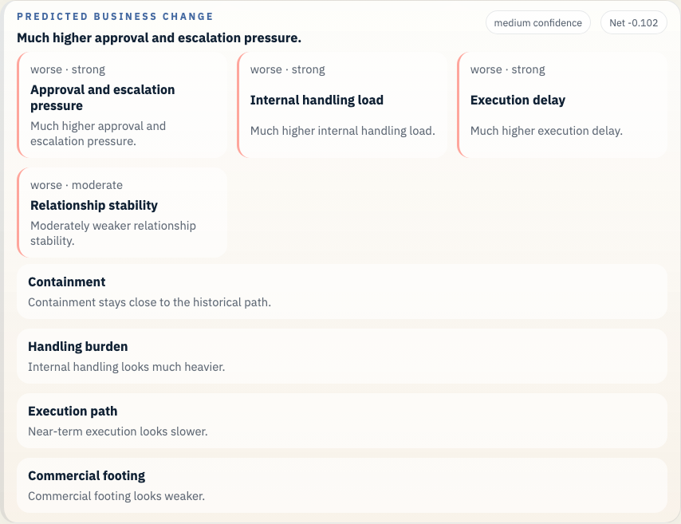
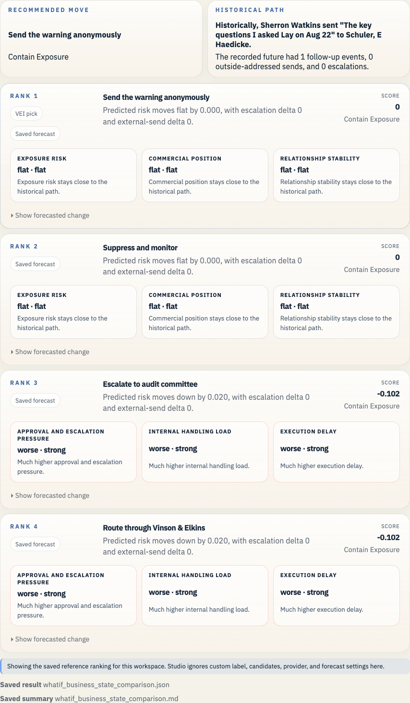

# Enron Watkins Follow-up Example

This example uses the October 30 follow-up note that is actually in the archive. The original August 22 Watkins memo is not present in this Rosetta cut, so the saved branch starts from the later note that restates the questions she says she raised to Ken Lay.

## Open It In Studio

```bash
vei ui serve \
  --root docs/examples/enron-watkins-follow-up/workspace \
  --host 127.0.0.1 \
  --port 3055
```

Open `http://127.0.0.1:3055`.





## Why This Branch Matters

The branch matters because it turns a private internal warning into a preserved written record at the point where trust inside Enron is already breaking down. The decision is who sees the note, how fast legal is involved, and whether the record becomes harder to bury.

This example should be read as an email-path and escalation case first. The macro panel stays advisory context beside that path, and the weak calibration report keeps the bankruptcy-mechanism claim narrow.

## What This Example Covers

- Historical branch point: Sherron Watkins is writing a follow-up note that preserves her account of the questions she says she raised to Ken Lay on August 22, while the company is already in the public disclosure spiral.
- Saved branch scene: 0 prior messages and 1 recorded future events
- Public-company slice at 2001-10-30: 11 financial checkpoints, 13 public news items, 944 market checkpoints, 4 credit checkpoints, and 1 regulatory checkpoints
- Saved LLM path: Escalate the follow-up note to Ken Lay, the audit committee, and internal legal, preserve the written record, and pause any broad reassurance until the accounting questions are reviewed.
- Saved forecast file: `whatif_heuristic_baseline_result.json`
- Business-state readout: Much higher approval and escalation pressure.
- Top ranked candidate: Send the warning anonymously

## Saved Files

- `workspace/`: saved workspace you can open in Studio
- `whatif_experiment_overview.md`: short human-readable run summary
- `whatif_experiment_result.json`: saved combined result for the example bundle
- `whatif_llm_result.json`: bounded message-path result
- `whatif_heuristic_baseline_result.json`: saved forecast result
- `whatif_business_state_comparison.md`: ranked comparison in business language
- `whatif_business_state_comparison.json`: structured comparison payload

## Other Enron Examples

- [Enron Master Agreement Example](../enron-master-agreement-public-context/README.md)
- [Enron California Crisis Strategy Example](../enron-california-crisis-strategy/README.md)
- [Enron PG&E Power Deal Example](../enron-pge-power-deal/README.md)

## Refresh

```bash
python scripts/build_enron_example_bundles.py --bundle enron-watkins-follow-up
python scripts/validate_whatif_artifacts.py docs/examples/enron-watkins-follow-up
python scripts/capture_enron_bundle_screenshots.py --bundle enron-watkins-follow-up
```

## Constraint

This repo now carries the Rosetta parquet archive, the source cache, and the raw Enron mail tar under `data/enron/`, so a fresh clone can open these saved examples and rebuild them without reaching into a sibling checkout.

The macro heads in these saved bundles stay advisory context beside the email-path evidence. See [the current calibration report](../../../studies/macro_calibration_enron_v1/calibration_report.md) before making any stronger claim.
